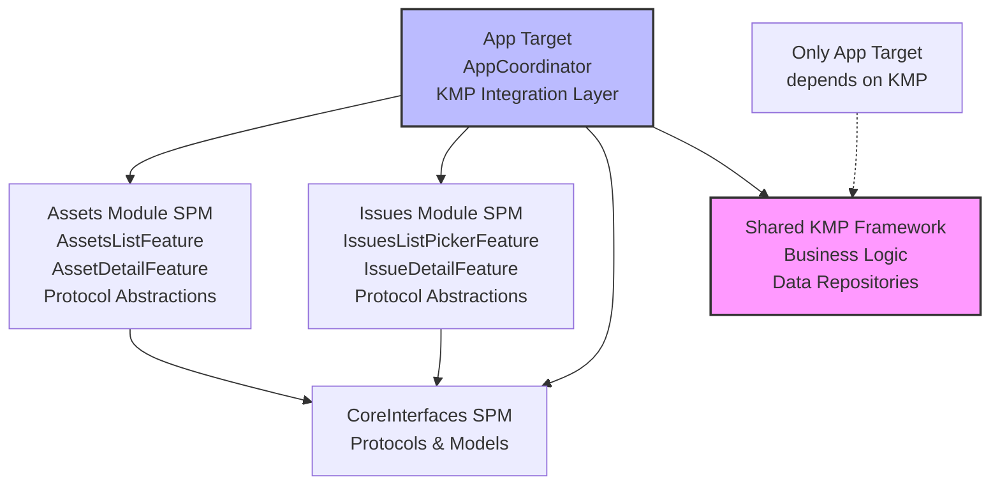
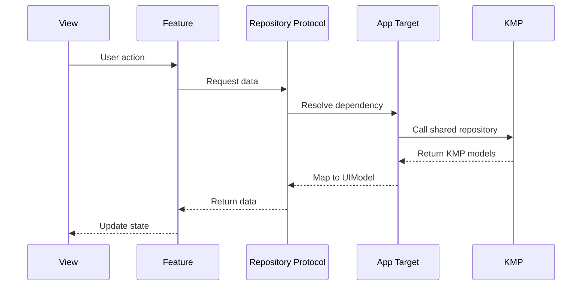
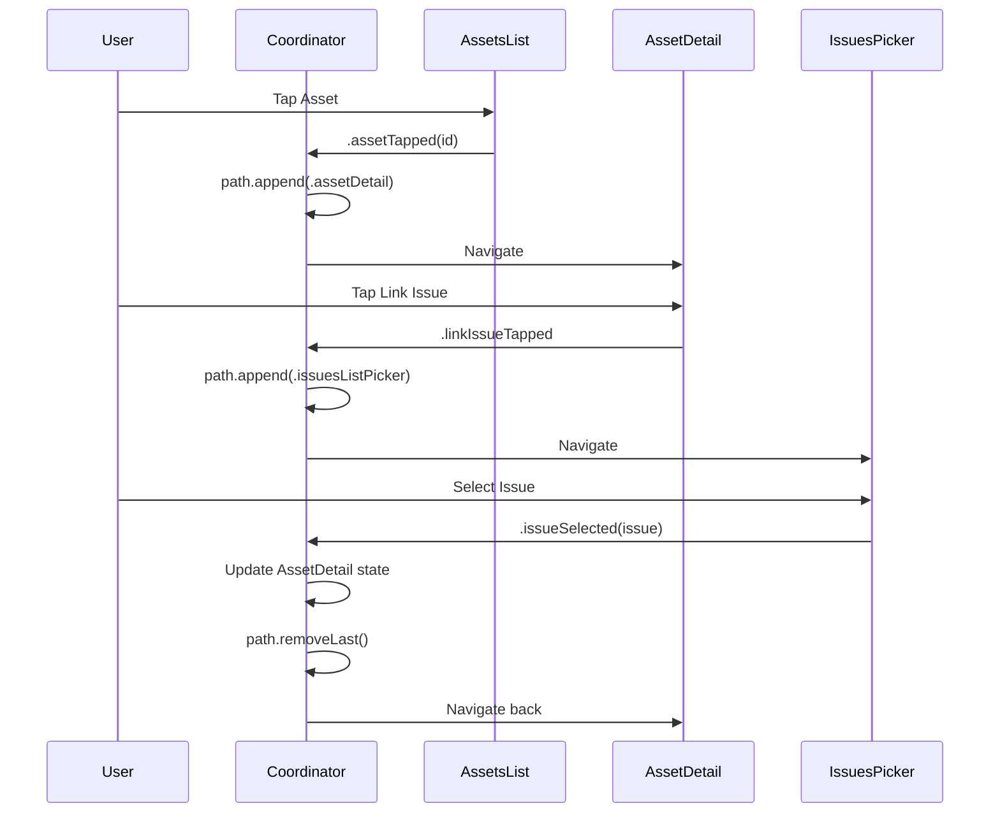
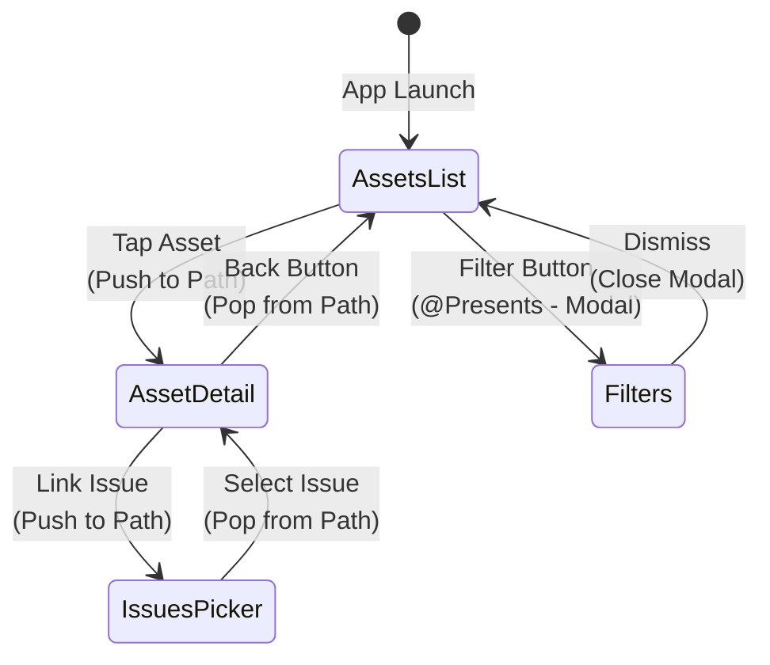

# iOS Modularization POC with Kotlin Multiplatform

A proof-of-concept demonstrating how to modularize an iOS application that uses Kotlin Multiplatform (KMP) for shared business logic, while maintaining proper navigation, testability, and preview support.

## Table of Contents

- [Overview](#overview)
- [Problems Solved](#problems-solved)
- [Architecture](#architecture)
- [Key Concepts](#key-concepts)
- [Problems & Solutions](#problems--solutions)
- [Pros and Cons](#pros-and-cons)
- [Key Learnings](#key-learnings)
- [Project Structure](#project-structure)
- [Code Examples](#code-examples)
- [Getting Started](#getting-started)
- [Technologies Used](#technologies-used)
- [Future Improvements](#future-improvements)

## Overview

This project demonstrates a scalable architecture for building modular iOS applications that integrate with Kotlin Multiplatform. It showcases how to structure Swift Package Manager (SPM) modules that cannot directly depend on KMP frameworks, while maintaining proper cross-module navigation using The Composable Architecture (TCA) and the Coordinator pattern.

## Problems Solved

### 1. Modularization with KMP
Structuring an iOS app into independent Swift Package modules while integrating Kotlin Multiplatform for shared business logic.

### 2. SPM + KMP Limitation
Swift Package Manager modules cannot directly depend on KMP frameworks. Only the App target can link the KMP framework, requiring a protocol abstraction layer.

### 3. Cross-Module Navigation
Ensuring proper back button behavior when navigating between screens from different modules. The challenge was maintaining a single navigation stack across module boundaries.

### 4. SwiftUI Previews
Enabling SwiftUI Previews in modular architecture without requiring KMP dependencies, allowing developers to preview UI components in isolation.

### 5. Testability
Module isolation allows testing features without KMP dependencies by providing mock implementations through TCA's dependency injection system.

## Architecture

### Critical Constraint

**Only the App target can depend on the KMP framework.** Swift Package modules use protocol abstractions, and the App target provides live implementations using KMP.

### Module Structure

```
- CoreInterfaces (SPM): Shared protocols and models (NO KMP dependency)
- Assets Module (SPM): Asset management features (NO KMP dependency)
- Issues Module (SPM): Issue tracking features (NO KMP dependency)
- App Target: Coordinator, composition layer, and KMP integration (ONLY target with KMP)
- Shared (KMP): Kotlin Multiplatform business logic and repositories
```

### Module Dependency Graph



### Dependency Injection Pattern

1. **Modules define repository protocols** in their own package
2. **App target implements live repositories** that communicates with KMP
3. **App target overrides `DependencyKey.liveValue`** with live implementations

### Data Flow with KMP



### Navigation Flow



### Navigation Stack States



## Key Concepts

### KMP Integration Pattern

- **Modules define what they need** (protocols) but not how (implementations)
- **App target bridges** Swift modules and KMP framework
- **Live repositories** in App target (e.g., `AssetsListLiveRepository.swift`) map KMP models to UIModels
- **Enables SwiftUI Previews** in modules without KMP framework
- **Test targets provide mock data** without KMP

### Coordinator Pattern

- **Centralized navigation management** in `AppCoordinator.swift`
- **Observes all child actions** via TCA composition
- **Manages single `NavigationStack` path** for cross-module navigation
- **Handles cross-module data flow** (e.g., passing selected issue to asset detail)

### Navigation Strategy (Hybrid Approach)

- **Coordinator Path**: Cross-module capable screens (AssetDetail, IssuesPicker)
  - These screens are added to the coordinator's `StackState`
  - Ensures proper back button behavior across module boundaries
  
- **@Presents**: Internal-only screens (Filters, Settings)
  - These screens stay within their module
  - Don't navigate to other modules
  - Keeps the coordinator lean and focused

### TCA Composition

- **Parent features observe child actions** through reducer composition
- **Action bubbling** enables coordinator to intercept navigation actions
- **State updates** managed through reducers
- **Dependencies injected** via TCA's dependency system

## Problems & Solutions

### Problem 1: SPM Cannot Depend on KMP Framework

**Problem:** Swift Package Manager modules cannot link KMP .framework files directly.

**Solution:** 
- Protocol abstraction layer in modules
- App target provides concrete implementations using KMP
- Dependency injection via TCA's `@Dependency` system

**Benefits:**
- Modules work in isolation
- SwiftUI Previews don't need KMP
- Tests use mocks instead of real KMP implementations

### Problem 2: Cross-Module Navigation Back Button

**Problem:** Back button showed "Assets" from Issues screen, skipping Asset Detail because:
- Asset Detail used TCA `@Presents` (not in NavigationStack path)
- Issues used separate `NavigationPath`
- iOS saw disconnected navigation stacks

**Solution:** 
- Coordinator with single `NavigationStack.StackState` for all cross-module screens
- All screens that participate in cross-module navigation are added to the coordinator's path
- Proper back button hierarchy: Issues → Asset Detail → Assets List

### Problem 3: Module Communication Without Direct Dependencies

**Problem:** Assets module cannot depend on Issues module (and vice versa), but they need to communicate.

**Solution:**
- App target coordinator observes actions from both modules
- Coordinator orchestrates navigation and data flow
- Updates state across features via `StackState` manipulation

### Problem 4: SwiftUI Previews in Modules

**Problem:** Previews need data but modules cannot depend on KMP.

**Solution:** Test dependencies with mock data.

**Example:**
```swift
#Preview {
    AssetsListView(store: Store(initialState: AssetsListFeature.State()) {
        AssetsListFeature()
    } withDependencies: {
        $0.assetsListRepository.getAllAssets = { 
            [
                AssetUIModel(id: "1", name: "Asset 1", status: "Active"),
                AssetUIModel(id: "2", name: "Asset 2", status: "Inactive")
            ]
        }
    })
}
```

## Pros and Cons

### Pros

✅ **Clear module boundaries** enforced by compiler  
✅ **Modules testable in isolation** without KMP framework  
✅ **SwiftUI Previews work** in all modules  
✅ **Full TCA composition** and observability maintained  
✅ **Testable navigation logic** centralized in coordinator  
✅ **Scalable architecture**: coordinator handles cross-module, `@Presents` handles internal  
✅ **Type-safe communication** via TCA actions  
✅ **Parallel development**: teams can work on modules independently  
✅ **Faster incremental builds**: unchanged modules not recompiled  

### Cons

❌ **More upfront complexity** in architecture setup  
❌ **Coordinator coupling**: knows about screens from multiple modules  
❌ **App target must implement** all repository bridges to KMP  
❌ **Deep `@Presents` nesting** cannot navigate cross-module  
❌ **Learning curve**: TCA + Coordinator + Dependency Injection  
❌ **Initial setup overhead** for new modules  

## Key Learnings

### KMP Integration Rules

1. **Only App target links KMP framework**
2. **Modules define repository protocols**, App target provides KMP implementations
3. **Use TCA's dependency system** for injection
4. **Map KMP models to UIModels** in App target's live repositories

### Navigation Rules

1. **Cross-module capable screens** must be in coordinator path
2. **Internal-only screens** can use `@Presents`
3. **Cannot mix `@Presents` with cross-module navigation** (creates disconnected stacks)
4. **Coordinator intercepts actions** to manage navigation

### Architecture Decisions

- **Removed Navigator protocol** (callbacks) in favor of TCA action observation
- **Protocol-based repository abstractions** in modules
- **Direct state mutation** in coordinator for cross-feature updates
- **`@retroactive` conformance** for `DependencyKey` in App target

## Project Structure

```
├── modularizediOSApp/              # App target (ONLY one with KMP)
│   ├── AppCoordinator.swift        # Navigation coordinator
│   ├── ContentView.swift           # Root view
│   ├── iOSApp.swift               # App entry point
│   ├── Assets/Dependencies/        # Live KMP repositories for Assets
│   │   ├── AssetsListLiveRepository.swift
│   │   └── AssetDetailLiveRepository.swift
│   └── Issues/Dependencies/        # Live KMP repositories for Issues
│       ├── IssuesListLiveRepository.swift
│       └── IssueDetailLiveRepository.swift
├── Modules/                        # Swift Package modules (NO KMP)
│   ├── Assets/                     # Assets feature module
│   │   ├── Package.swift
│   │   ├── Sources/Assets/
│   │   │   ├── AssetsList/
│   │   │   │   ├── AssetsListFeature.swift
│   │   │   │   └── AssetsListView.swift
│   │   │   ├── AssetDetail/
│   │   │   │   ├── AssetDetailFeature.swift
│   │   │   │   └── AssetDetailView.swift
│   │   │   ├── AssetFilters/
│   │   │   │   ├── AssetFiltersFeature.swift
│   │   │   │   └── AssetFiltersView.swift
│   │   │   └── Dependencies/       # Protocol definitions
│   │   │       ├── AssetsListRepository.swift
│   │   │       └── AssetDetailRepository.swift
│   │   └── Tests/
│   │       └── AssetsTests/
│   ├── Issues/                     # Issues feature module
│   │   ├── Package.swift
│   │   ├── Sources/Issues/
│   │   │   ├── IssuesListPicker/
│   │   │   │   ├── IssuesListPickerFeature.swift
│   │   │   │   └── IssuesListPickerView.swift
│   │   │   ├── IssueDetail/
│   │   │   │   ├── IssueDetailFeature.swift
│   │   │   │   └── IssueDetailView.swift
│   │   │   └── Dependencies/       # Protocol definitions
│   │   │       ├── IssuesListRepository.swift
│   │   │       └── IssueDetailRepository.swift
│   │   └── Tests/
│   │       └── IssuesTests/
│   └── CoreInterfaces/             # Shared interfaces
│       ├── Package.swift
│       └── Sources/CoreInterfaces/
│           ├── Assets/             # Asset models
│           │   ├── AssetUIModel.swift
│           │   └── AssetDetailUIModel.swift
│           ├── Issues/             # Issue models
│           │   ├── IssueUIModel.swift
│           │   └── IssueDetailUIModel.swift
│           └── Navigation/         # Navigation types
│               └── NavigationDestination.swift
├── shared/                         # Kotlin Multiplatform
│   ├── build.gradle.kts
│   └── src/
│       ├── commonMain/kotlin/
│       │   └── com/fedetorresdev/
│       ├── iosMain/kotlin/
│       └── androidMain/kotlin/
├── androidApp/                     # Android app (optional)
├── build.gradle.kts
├── settings.gradle.kts
└── README.md
```

## Code Examples

### Module Defines Protocol

Modules define what they need without knowing how it's implemented:

```swift
// Modules/Assets/Sources/Assets/Dependencies/AssetsListRepository.swift
import ComposableArchitecture
import CoreInterfaces

public struct AssetsListRepository {
    public var getAllAssets: @Sendable () async -> [AssetUIModel]
    
    public init(getAllAssets: @escaping @Sendable () async -> [AssetUIModel]) {
        self.getAllAssets = getAllAssets
    }
}

extension AssetsListRepository: DependencyKey {
    public static var liveValue: AssetsListRepository {
        fatalError("AssetsListRepository has no live implementation. Override in the app target.")
    }
}

extension DependencyValues {
    public var assetsListRepository: AssetsListRepository {
        get { self[AssetsListRepository.self] }
        set { self[AssetsListRepository.self] = newValue }
    }
}
```

### App Target Provides KMP Implementation

The App target bridges Swift modules and KMP:

```swift
// modularizediOSApp/Assets/Dependencies/AssetsListLiveRepository.swift
import Assets
import CoreInterfaces
import ComposableArchitecture
import shared // KMP framework

public struct AssetsListLiveRepository: @unchecked Sendable {
    public func getAllAssets() -> [AssetUIModel] {
        let repository = AssetListLiveRepository() // From KMP
        return repository.getAllAssets().map { kmpAsset in
            AssetUIModel(
                id: kmpAsset.id,
                name: kmpAsset.name,
                status: kmpAsset.status
            )
        }
    }
}

extension Assets.AssetsListRepository: @retroactive DependencyKey {
    public static var liveValue: Assets.AssetsListRepository {
        return Self(
            getAllAssets: {
                let repository = AssetsListLiveRepository()
                return repository.getAllAssets()
            }
        )
    }
}
```

### Coordinator Manages Cross-Module Navigation

```swift
// modularizediOSApp/AppCoordinator.swift
import ComposableArchitecture
import Assets
import Issues

@Reducer
struct AppCoordinator {
    @ObservableState
    struct State: Equatable {
        var path = StackState<Path.State>()
        var assetsList = AssetsListFeature.State()
    }
    
    enum Action {
        case path(StackActionOf<Path>)
        case assetsList(AssetsListFeature.Action)
    }
    
    @Reducer(state: .equatable)
    enum Path {
        case assetDetail(AssetDetailFeature)
        case issuesListPicker(IssuesListPickerFeature)
    }
    
    var body: some ReducerOf<Self> {
        Scope(state: \.assetsList, action: \.assetsList) {
            AssetsListFeature()
        }
        
        Reduce { state, action in
            switch action {
            // Navigate from Assets List to Asset Detail
            case let .assetsList(.assetTapped(id)):
                state.path.append(.assetDetail(AssetDetailFeature.State(assetId: id)))
                return .none
                
            // Navigate from Asset Detail to Issues Picker
            case .path(.element(id: _, action: .assetDetail(.linkIssueTapped))):
                state.path.append(.issuesListPicker(IssuesListPickerFeature.State()))
                return .none
                
            // Return from Issues Picker with selected issue
            case let .path(.element(id: _, action: .issuesListPicker(.issueSelected(issue)))):
                // Update the AssetDetail state with selected issue
                for id in state.path.ids {
                    if case .assetDetail(var assetDetailState) = state.path[id: id] {
                        assetDetailState.linkedIssue = issue
                        state.path[id: id] = .assetDetail(assetDetailState)
                        break
                    }
                }
                // Pop back to Asset Detail
                state.path.removeLast()
                return .none
                
            // Cancel Issues Picker
            case .path(.element(id: _, action: .issuesListPicker(.cancelTapped))):
                state.path.removeLast()
                return .none
                
            default:
                return .none
            }
        }
        .forEach(\.path, action: \.path)
    }
}
```

### Feature Uses @Presents for Internal Navigation

```swift
// Modules/Assets/Sources/Assets/AssetsList/AssetsListFeature.swift
@Reducer
public struct AssetsListFeature: Sendable {
    @ObservableState
    public struct State: Equatable {
        var assets: [AssetUIModel] = []
        @Presents var destination: Destination.State? // Internal navigation
        // ...
    }
    
    public enum Action {
        case assetTapped(id: String) // Coordinator intercepts this
        case filtersTapped // Internal navigation
        case destination(PresentationAction<Destination.Action>)
        // ...
    }
    
    @Reducer(state: .equatable)
    public enum Destination {
        case filters(AssetFiltersFeature) // Purely internal to Assets module
    }
    
    public var body: some ReducerOf<Self> {
        Reduce { state, action in
            switch action {
            case .filtersTapped:
                // Show filters sheet - pure internal navigation!
                state.destination = .filters(AssetFiltersFeature.State(
                    selectedStatuses: state.selectedStatuses,
                    selectedCategories: state.selectedCategories
                ))
                return .none
            // ...
            }
        }
        .ifLet(\.$destination, action: \.destination)
    }
}
```

## Getting Started

### Prerequisites

- **Xcode 15+**
- **Swift 5.9+**
- **Kotlin 1.9+**
- **Gradle 8.0+**

### Setup

1. **Clone the repository**
   ```bash
   git clone <repository-url>
   cd poc_ios_modularization
   ```

2. **Open the workspace**
   ```bash
   open modularizediOSApp/ModularizediOSApp.xcworkspace
   ```

3. **Build the project**
   - The KMP framework will be built automatically via Gradle
   - Press `Cmd + B` to build

4. **Run on simulator**
   - Select a simulator target
   - Press `Cmd + R` to run

5. **Run tests**
   - Press `Cmd + U` to run all tests

### Project Configuration

The project uses an Xcode workspace that includes:
- The main iOS app target
- Swift Package modules (Assets, Issues, CoreInterfaces)
- KMP framework built via Gradle

## Technologies Used

- **[SwiftUI](https://developer.apple.com/xcode/swiftui/)**: Declarative UI framework
- **[The Composable Architecture (TCA)](https://github.com/pointfreeco/swift-composable-architecture)**: State management and composition
- **[Kotlin Multiplatform (KMP)](https://kotlinlang.org/docs/multiplatform.html)**: Shared business logic
- **[Swift Package Manager](https://swift.org/package-manager/)**: Module dependency management
- **[Xcode Workspace](https://developer.apple.com/documentation/xcode/creating-an-xcode-workspace)**: Project organization

## Future Improvements

### Scalability
- Add more modules to demonstrate scalability (Users, Documents, Settings)
- Benchmark build times: modular vs monolithic
- Module dependency graph visualization

### Navigation
- Implement deep linking through coordinator
- URL-based navigation for universal links
- State restoration for background/foreground transitions

### Features
- Add module-level feature flags via TCA dependencies
- Demonstrate A/B testing across modules
- Analytics integration in coordinator

### Testing & CI/CD
- Performance metrics for modular vs monolithic builds
- CI/CD pipeline for module testing
- Snapshot testing for UI components
- Integration tests across modules

### KMP Integration
- Demonstrate shared KMP ViewModels (if desired)
- Explore SKIE for better Swift/Kotlin interop
- Share more business logic (validation, formatting, etc.)

## Contributing

This is a proof-of-concept project. Feel free to explore, experiment, and adapt the patterns to your own projects.

## License

[Your License Here]

## Acknowledgments

- [The Composable Architecture](https://github.com/pointfreeco/swift-composable-architecture) by Point-Free
- [Kotlin Multiplatform](https://kotlinlang.org/docs/multiplatform.html) by JetBrains
- iOS modularization community for sharing patterns and practices

---

**Questions or feedback?** Open an issue or start a discussion!
