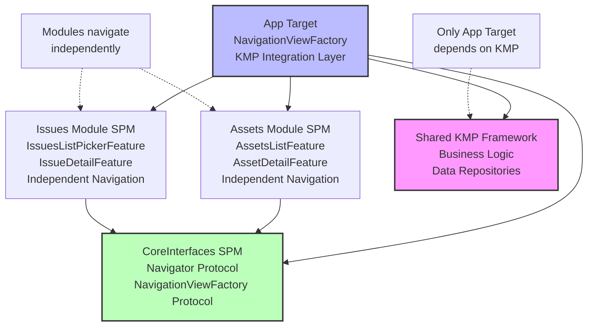
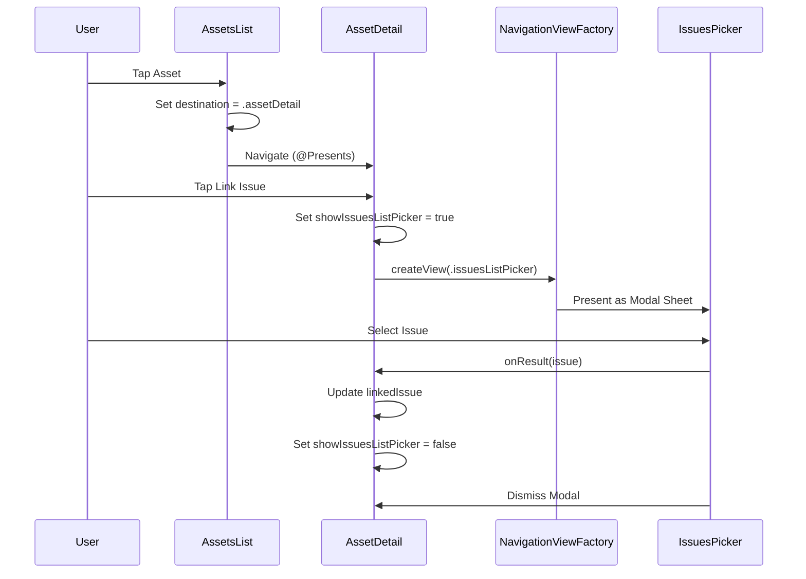
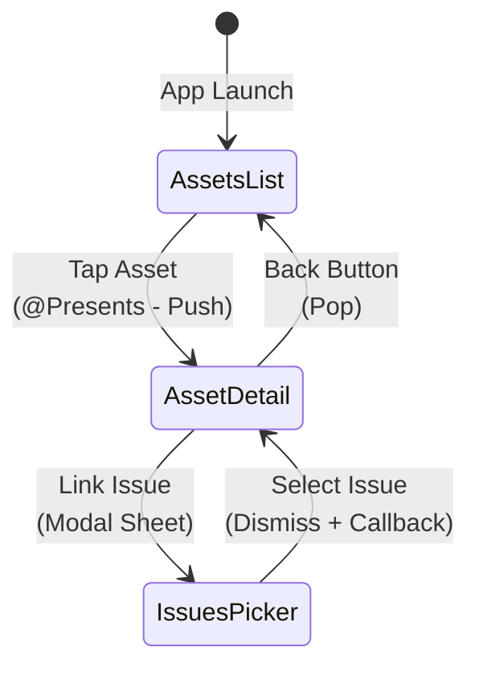

# iOS Modularization POC - Navigator Protocol Approach

A proof-of-concept demonstrating **decentralized navigation** for modular iOS applications using the Navigator protocol pattern with modal presentations for cross-module navigation.

> **Note:** This is the `modal_solution` branch. For an alternative approach using centralized navigation with the Coordinator pattern, see the `centralized_solution` branch.

## Table of Contents

- [Overview](#overview)
- [Problems Solved](#problems-solved)
- [Architecture](#architecture)
- [Navigator Protocol Pattern](#navigator-protocol-pattern)
- [How It Works](#how-it-works)
- [Pros and Cons](#pros-and-cons)
- [Comparison: Navigator vs Coordinator](#comparison-navigator-vs-coordinator)
- [When to Use This Approach](#when-to-use-this-approach)
- [Code Examples](#code-examples)

## Overview

This branch demonstrates a **decentralized navigation architecture** where each module manages its own navigation independently. Cross-module navigation is achieved through **modal presentations** (sheets) and a **Navigator protocol** that abstracts navigation logic.

Unlike the centralized Coordinator approach, this pattern provides **maximum module independence** at the cost of modal-based cross-module navigation instead of push/drilldown navigation.

## Problems Solved

### 1. Modularization with KMP
Structuring an iOS app into independent Swift Package modules while integrating Kotlin Multiplatform for shared business logic.

### 2. SPM + KMP Limitation
Swift Package Manager modules cannot directly depend on KMP frameworks. Only the App target can link the KMP framework, requiring a protocol abstraction layer.

### 3. Cross-Module Navigation
Enabling navigation between modules without creating dependencies between them. Uses modal presentations for cross-module flows.

### 4. Module Independence
Each module manages its own navigation without depending on a central coordinator. Modules can be developed, tested, and previewed in complete isolation.

### 5. SwiftUI Previews
Enabling SwiftUI Previews in modular architecture without requiring KMP dependencies, using `FakeNavigator` for preview support.

### 6. Testability
Module isolation allows testing features without KMP dependencies by providing mock implementations through TCA's dependency injection system.

## Architecture

### Critical Constraint

**Only the App target can depend on the KMP framework.** Swift Package modules use protocol abstractions, and the App target provides live implementations using KMP.

### Module Structure

```
- CoreInterfaces (SPM): Shared protocols and models (NO KMP dependency)
- Assets Module (SPM): Asset management features (NO KMP dependency)
- Issues Module (SPM): Issue tracking features (NO KMP dependency)
- App Target: NavigationViewFactory and KMP integration (ONLY target with KMP)
- Shared (KMP): Kotlin Multiplatform business logic and repositories
```

### Module Dependency Graph



### Navigation Flow with Navigator Protocol



### Navigation Stack States



## Navigator Protocol Pattern

### Core Components

#### 1. Navigator Protocol

Defines the navigation abstraction available to all modules:

```swift
public protocol Navigator: Equatable, Sendable {
    func navigate(to destination: NavigationDestination)
    func navigate(to destination: NavigationDestination, style: NavigationPresentationStyle)
    func navigate(to destination: NavigationDestination, onResult: @escaping (any NavigationResult) -> Void)
    func navigate(to destination: NavigationDestination, style: NavigationPresentationStyle, onResult: @escaping (any NavigationResult) -> Void)
    func dismiss(animated: Bool)
    func pop(animated: Bool)
    func viewForDestination(_ destination: NavigationDestination) -> AnyView
    func viewForDestination(_ destination: NavigationDestination, onResult: @escaping (any NavigationResult) -> Void) -> AnyView
}
```

**Key Features:**
- Protocol-based abstraction for navigation
- Support for navigation with result callbacks
- Can be injected via SwiftUI Environment
- Easy to mock for testing and previews

#### 2. NavigationViewFactory Protocol

Responsible for creating views for cross-module destinations:

```swift
public protocol NavigationViewFactory: Equatable, Sendable {
    func createView(for destination: NavigationDestination) -> AnyView
    func createView(for destination: NavigationDestination, onResult: @escaping (any NavigationResult) -> Void) -> AnyView
}
```

**Key Features:**
- App target implements this to bridge modules
- Creates views from other modules without direct dependencies
- Supports result callbacks for modal flows

#### 3. PathNavigator Implementation

Concrete implementation using SwiftUI's `NavigationPath`:

```swift
public struct PathNavigator: Navigator {
    @Binding private var navigationPath: NavigationPath
    private let viewFactory: any NavigationViewFactory
    
    public func navigate(to destination: NavigationDestination) {
        navigationPath.append(destination)
    }
    
    public func viewForDestination(_ destination: NavigationDestination, onResult: @escaping (any NavigationResult) -> Void) -> AnyView {
        return viewFactory.createView(for: destination, onResult: onResult)
    }
}
```

### How Modules Navigate

#### Within Module (Push Navigation)

Modules use TCA's `@Presents` for internal navigation:

```swift
@Reducer
struct AssetsListFeature {
    @ObservableState
    struct State {
        @Presents var destination: Destination.State?
    }
    
    @Reducer
    enum Destination {
        case assetDetail(AssetDetailFeature)
    }
    
    // Navigate to asset detail (same module)
    case let .assetTapped(id):
        state.destination = .assetDetail(AssetDetailFeature.State(assetId: id))
}
```

#### Cross-Module (Modal Navigation)

For cross-module navigation, modules use modal sheets with `NavigationViewFactory`:

```swift
struct AssetDetailView: View {
    @Environment(\.navigationViewFactory) var navigationViewFactory
    @Bindable var store: StoreOf<AssetDetailFeature>
    
    var body: some View {
        // ... content
        .sheet(isPresented: $store.showIssuesListPicker) {
            if let factory = navigationViewFactory {
                factory.createView(for: .issuesListPicker) { result in
                    if let issue = result as? IssueUIModel {
                        store.send(.issueSelected(issue))
                    }
                }
            }
        }
    }
}
```

## How It Works

### 1. App Target Setup

The app target provides the `NavigationViewFactory` implementation:

```swift
class AppNavigationViewFactory: NavigationViewFactory {
    func createView(for destination: NavigationDestination, onResult: @escaping (any NavigationResult) -> Void) -> AnyView {
        switch destination {
        case .issuesListPicker:
            let provider = IssuesListPickerProvider { issue in
                onResult(issue)
            }
            return AnyView(
                NavigationStack {
                    provider.make()
                }
            )
        // ... other destinations
        }
    }
}
```

### 2. Inject via Environment

The app target injects the factory into the environment:

```swift
struct ContentView: View {
    private let navigationViewFactory = AppNavigationViewFactory()
    
    var body: some View {
        assetsProvider.make()
            .environment(\.navigationViewFactory, navigationViewFactory)
    }
}
```

### 3. Modules Access Environment

Modules access the factory from the environment to present cross-module views:

```swift
@Environment(\.navigationViewFactory) var navigationViewFactory
```

### 4. Modal Presentation for Cross-Module

Cross-module navigation uses modal sheets, which naturally separate navigation contexts:

- ✅ No back button confusion (modal has its own navigation)
- ✅ Clear visual distinction between modules
- ✅ Complete module independence

## Pros and Cons

### Pros

1. **Maximum Module Independence**
   - Each module owns its navigation completely
   - No centralized coordinator that knows about all modules
   - Modules can be developed in complete isolation
   - Easy to extract modules to separate packages

2. **Development Speed**
   - Faster build times due to incremental builds
   - Reduced cognitive load: focus on one module at a time
   - Less merge conflicts in navigation code
   - Easier unit testing per module
   - SwiftUI Previews work with `FakeNavigator`

3. **Clear Code Ownership**
   - Teams can own and maintain specific modules
   - Clear boundaries make it easier to assign responsibilities
   - No central navigation logic to coordinate changes

4. **Flexibility**
   - Easy to add new navigation patterns per module
   - Each module can choose its preferred navigation style
   - No constraints from central coordinator

5. **Testing**
   - Mock Navigator easily for tests
   - Test modules without any navigation infrastructure
   - Isolated feature testing

### Cons

1. **Modal-Only Cross-Module Navigation**
   - Cannot do push/drilldown navigation across modules
   - Cross-module flows always presented as sheets/modals
   - UX limitation: users expect push navigation in some cases
   - Back button doesn't work across module boundaries

2. **Callback Complexity**
   - Result handling through closures can become complex
   - Type erasure with `any NavigationResult` loses type safety
   - Callback chains can be hard to debug
   - Memory management concerns with closures

3. **Less Centralized Control**
   - No single place to see all app navigation
   - Harder to implement global navigation features (analytics, deep linking)
   - Navigation logic scattered across modules
   - Difficult to enforce navigation patterns

4. **Environment Dependency**
   - Modules depend on environment injection
   - Easy to forget to inject navigator in tests
   - Environment values can be nil, requires optional handling

5. **App Target Coupling**
   - `NavigationViewFactory` must know about all cross-module destinations
   - App target still couples modules indirectly through factory
   - Adding new cross-module navigation requires app target changes

## Comparison: Navigator vs Coordinator

| Aspect | Navigator (Modal) | Coordinator (Centralized) |
|--------|------------------|---------------------------|
| **Cross-Module Navigation** | Modal sheets only | Push/drilldown supported |
| **Module Independence** | ✅ Maximum independence | ⚠️ Coordinator knows all modules |
| **Navigation Logic** | Decentralized (per module) | Centralized (one coordinator) |
| **Back Button** | ❌ Doesn't work cross-module | ✅ Works correctly |
| **UX Patterns** | Modal-centric | Push and Modal |
| **Type Safety** | ⚠️ Type-erased callbacks | ✅ Strongly typed actions |
| **Observability** | ⚠️ Scattered across modules | ✅ All navigation observable |
| **Testing** | ✅ Easy mocking | ✅ Testable coordinator |
| **Scalability** | ✅ Each module scales independently | ⚠️ Coordinator can grow large |
| **Deep Linking** | ❌ Hard to implement | ✅ Easier to implement |
| **Analytics** | ⚠️ Must instrument per module | ✅ Central instrumentation point |
| **Setup Complexity** | ✅ Simple per module | ⚠️ More upfront coordination |
| **State Management** | Callback-based | TCA action-based |
| **Module Extraction** | ✅ Very easy | ⚠️ Must update coordinator |

### Visual Comparison

**Navigator Approach (Modal):**
```
Assets Module (NavigationStack)
  ├─ Assets List
  └─ Asset Detail (@Presents)
       └─ [Sheet] Issues Module (New NavigationStack)
            ├─ Issues Picker
            └─ Issue Detail

✅ Modules independent
❌ Modal-only cross-module
```

**Coordinator Approach (Push):**
```
App Coordinator (Single NavigationStack)
  ├─ Assets List
  ├─ Asset Detail      ← All in one path
  └─ Issues Picker     ← All in one path

✅ Push navigation works
❌ Coordinator couples modules
```

## When to Use This Approach

### ✅ Use Navigator (Modal) When:

1. **Module independence is critical**
   - Large teams working on separate modules
   - Modules might be extracted to separate packages
   - Want to minimize coordination between teams

2. **Modal UX is acceptable**
   - Your app design uses modals for cross-feature flows
   - Selection/picker patterns are common
   - Users don't expect push navigation across features

3. **Rapid prototyping**
   - Want to quickly add navigation without coordinator setup
   - Each module team can move independently
   - Don't want to coordinate on central navigation

4. **Simple cross-module flows**
   - Limited cross-module navigation
   - Most navigation stays within modules
   - Cross-module flows are mostly selection/picker patterns

### ❌ Don't Use Navigator When:

1. **Push navigation is required**
   - Users expect back button to work across features
   - Deep navigation hierarchies spanning modules
   - Navigation feels more like a drill-down than a modal

2. **Need centralized control**
   - Want to track all navigation in one place
   - Need global navigation features (analytics, deep linking)
   - Want to enforce navigation patterns

3. **Complex cross-module flows**
   - Multi-step wizards across modules
   - Complex state passing between modules
   - Need to observe navigation in parent features

## Code Examples

### Module Defines Navigation (Assets Module)

Internal navigation uses `@Presents`:

```swift
// Modules/Assets/Sources/Assets/AssetsList/AssetsListFeature.swift
@Reducer
struct AssetsListFeature {
    @ObservableState
    struct State {
        var assets: [AssetUIModel] = []
        @Presents var destination: Destination.State?
    }
    
    enum Action {
        case assetTapped(id: String)
        case destination(PresentationAction<Destination.Action>)
    }
    
    @Reducer(state: .equatable)
    enum Destination {
        case assetDetail(AssetDetailFeature)
    }
    
    var body: some ReducerOf<Self> {
        Reduce { state, action in
            switch action {
            case let .assetTapped(id):
                // Navigate within module using @Presents
                state.destination = .assetDetail(AssetDetailFeature.State(assetId: id))
                return .none
            // ...
            }
        }
        .ifLet(\.$destination, action: \.destination)
    }
}
```

### Cross-Module Modal Navigation

Asset Detail navigates to Issues module via modal:

```swift
// Modules/Assets/Sources/Assets/AssetDetail/AssetDetailView.swift
struct AssetDetailView: View {
    @Environment(\.navigationViewFactory) var navigationViewFactory
    @Bindable var store: StoreOf<AssetDetailFeature>
    
    var body: some View {
        VStack {
            // ... content
        }
        .sheet(isPresented: Binding(
            get: { store.showIssuesListPicker },
            set: { if !$0 { store.send(.dismissIssuesPicker) } }
        )) {
            if let factory = navigationViewFactory {
                // App target creates the Issues view
                factory.createView(for: .issuesListPicker) { result in
                    if let issue = result as? IssueUIModel {
                        store.send(.issueSelected(issue))
                    }
                }
            }
        }
    }
}
```

### Feature Handles Selection

```swift
// Modules/Assets/Sources/Assets/AssetDetail/AssetDetailFeature.swift
@Reducer
struct AssetDetailFeature {
    @ObservableState
    struct State {
        var linkedIssue: IssueUIModel?
        var showIssuesListPicker: Bool = false
    }
    
    enum Action {
        case linkIssueTapped
        case issueSelected(IssueUIModel)
        case dismissIssuesPicker
    }
    
    var body: some ReducerOf<Self> {
        Reduce { state, action in
            switch action {
            case .linkIssueTapped:
                state.showIssuesListPicker = true
                return .none
                
            case let .issueSelected(issue):
                state.linkedIssue = issue
                state.showIssuesListPicker = false
                return .none
                
            case .dismissIssuesPicker:
                state.showIssuesListPicker = false
                return .none
            }
        }
    }
}
```

### App Target Implements ViewFactory

```swift
// modularizediOSApp/NavigationViewFactory.swift
import Issues

class AppNavigationViewFactory: NavigationViewFactory {
    func createView(for destination: NavigationDestination, onResult: @escaping (any NavigationResult) -> Void) -> AnyView {
        switch destination {
        case .issuesListPicker:
            // App target creates Issues module views
            let provider = IssuesListPickerProvider { issue in
                onResult(issue) // Pass result back via callback
            }
            return AnyView(
                NavigationStack {
                    provider.make()
                }
            )
        case .assetsList, .issuesList:
            fatalError("not implemented")
        }
    }
}
```

### Preview Support

Modules use `FakeNavigator` for previews:

```swift
#Preview {
    AssetDetailView(
        store: Store(initialState: AssetDetailFeature.State(assetId: "1")) {
            AssetDetailFeature()
        }
    )
    .environment(\.navigator, FakeNavigator())
    .environment(\.navigationViewFactory, nil) // Or provide fake factory
}
```

## Summary

The Navigator protocol approach provides **maximum module independence** through decentralized navigation with modal presentations for cross-module flows. It's ideal when module isolation is more important than seamless push navigation across features.

For applications requiring push/drilldown navigation across modules with proper back button behavior, see the **Coordinator approach** on the `back_navigation_issue` branch.

---

**Questions or feedback?** Open an issue or start a discussion!
