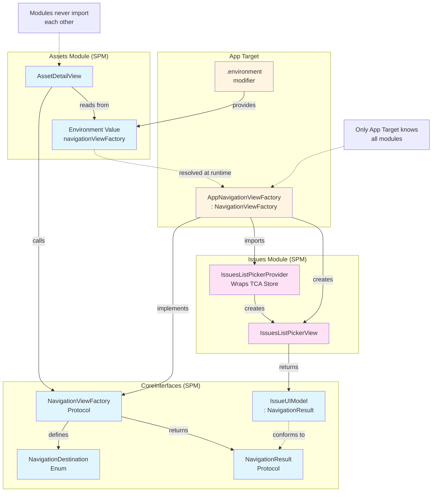
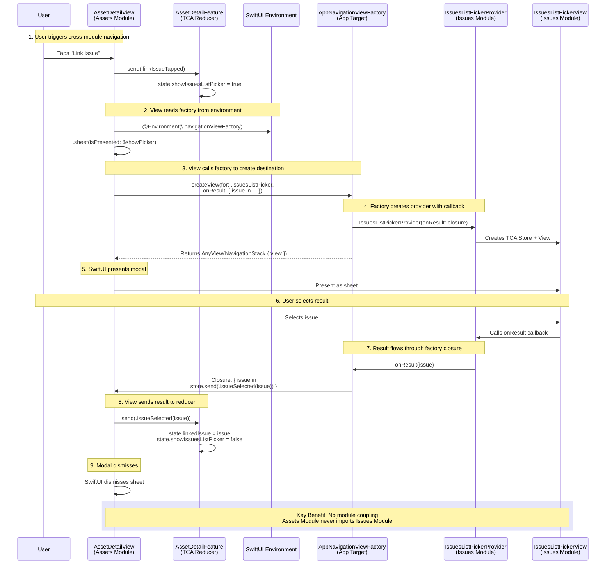

# iOS Modularization POC - Modal Solution

> **Branch:** `modal_solution`  
> **Approach:** Environment-injected NavigationViewFactory for cross-module modal navigation

This branch demonstrates modular iOS architecture with complete module independence, using a NavigationViewFactory pattern for cross-module navigation via modals.

## Table of Contents

- [Overview](#overview)
- [Architecture](#architecture)
  - [NavigationViewFactory Pattern Diagram](#diagram-navigationviewfactory-pattern)
- [Navigation Flow](#navigation-flow)
  - [Cross-Module Navigation Sequence](#diagram-cross-module-navigation-flow)
- [Key Patterns](#key-patterns)
- [Pros and Cons](#pros-and-cons)
- [Code Examples](#code-examples)

## Overview

A lightweight solution where:
- Each module manages its own internal navigation
- Cross-module navigation uses `NavigationViewFactory` protocol
- Factory is injected via SwiftUI environment
- Modules remain completely independent
- Results flow back through closures

## Key Features

- **Module Independence:** No dependencies between feature modules
- **Environment Injection:** Factory provided through SwiftUI environment
- **Modal Navigation:** Cross-module flows shown as sheets
- **Type-Safe:** Protocol-based destinations and results
- **Simple:** No coordinator coupling, navigation controllers, or buses
- **Scalable:** Easy to add new modules by updating the factory

## Architecture

### Module Structure

```
CoreInterfaces (SPM)  → Protocols, Models, NavigationViewFactory protocol
Assets Module (SPM)   → Self-contained Asset Features
Issues Module (SPM)   → Self-contained Issue Features
App Target            → AppNavigationViewFactory implementation + KMP Bridge
Shared (KMP)          → Business Logic
```

### Critical Constraint

**Only the App target should depend on other modules and KMP.** SPM modules:
- Define protocols for repositories (injected via TCA Dependencies)
- Use `NavigationViewFactory` from CoreInterfaces (no concrete implementation)
- Never import other feature modules

#### Diagram: NavigationViewFactory Pattern



**Key Points:**
- CoreInterfaces defines the protocol contract
- Modules only know about the protocol, not implementations
- App Target implements the factory and knows all modules
- Factory is injected via SwiftUI environment

## Navigation Flow

### How Cross-Module Navigation Works

1. **Module requests navigation** by reading factory from environment
2. **Factory creates view** from the destination module
3. **Result flows back** through closure callback
4. **Module handles result** and dismisses modal

#### Diagram: Cross-Module Navigation Flow



### Internal Module Navigation

Within a module, standard TCA navigation is used:

```
Assets List → (Push) Asset Detail  [Within Assets Module]
Issues Picker → (Push) Issue Detail [Within Issues Module]
```

Internal navigation uses `@Presents` with `.navigationDestination` for push navigation.

## Key Patterns

### 1. NavigationViewFactory Protocol

Defined in CoreInterfaces, implemented in App Target:

```swift
// In CoreInterfaces
public protocol NavigationViewFactory: Equatable, Sendable {
    func createView(for destination: NavigationDestination) -> AnyView
    func createView(for destination: NavigationDestination, 
                   onResult: @escaping (any NavigationResult) -> Void) -> AnyView
}

public extension EnvironmentValues {
    var navigationViewFactory: (any NavigationViewFactory)? {
        get { self[NavigationViewFactoryKey.self] }
        set { self[NavigationViewFactoryKey.self] = newValue }
    }
}
```

### 2. Environment Injection

App Target injects the factory at the root:

```swift
// In ContentView (App Target)
struct ContentView: View {
    private let navigationViewFactory = AppNavigationViewFactory()
    
    var body: some View {
        assetsProvider.make()
            .environment(\.navigationViewFactory, navigationViewFactory)
    }
}
```

### 3. Module Provider Pattern

Each module exposes a Provider that accepts result callbacks:

```swift
// In Issues Module
public struct IssuesListPickerProvider {
    private let onResult: (IssueUIModel) -> Void
    
    public init(onResult: @escaping (IssueUIModel) -> Void) {
        self.onResult = onResult
    }
    
    public func make() -> some View {
        IssuesListPickerView(
            store: Store(initialState: IssuesListPickerFeature.State()) {
                IssuesListPickerFeature()
            },
            onIssueSelected: { issue in
                onResult(issue)
            }
        )
    }
}
```

### 4. NavigationResult Protocol

Type-safe result handling:

```swift
// In CoreInterfaces
public protocol NavigationResult: Codable {
    static var resultType: String { get }
}

// Models conform to NavigationResult
public struct IssueUIModel: NavigationResult {
    public static let resultType: String = "IssueUIModel"
    // ... properties
}
```

## Pros and Cons

### Pros

✅ **Complete Module Independence:** Modules never import each other  
✅ **Environment-Based:** Leverages SwiftUI's native dependency injection  
✅ **Type-Safe:** Protocol-based approach with compile-time safety  
✅ **Simple Architecture:** No coordinators, buses, or continuation managers  
✅ **Testable:** Modules tested in isolation with mock factories  
✅ **Scalable:** Adding modules only requires factory updates  
✅ **Clear Contracts:** NavigationDestination and NavigationResult define boundaries  
✅ **No KMP in Modules:** SPM modules remain KMP-free  

### Cons

❌ **Modal-Only Cross-Module:** Cannot push cross-module screens to shared stack  
❌ **Factory Knows All:** App Target must import all modules  
❌ **Closure-Based Results:** Not as elegant as async/await  
❌ **Type Erasure:** Uses `AnyView` for flexibility  
❌ **Manual Factory Updates:** Adding destinations requires factory changes  
❌ **UX Limitation:** No seamless navigation hierarchies across modules  

## Code Examples

### 1. Using the Factory in a Module

```swift
// AssetDetailView.swift (Assets Module)
import CoreInterfaces
import SwiftUI

struct AssetDetailView: View {
    @Environment(\.navigationViewFactory) var navigationViewFactory
    @Bindable var store: StoreOf<AssetDetailFeature>
    
    var body: some View {
        VStack {
            // ... content ...
            Button("Link Issue") {
                store.send(.linkIssueTapped)
            }
        }
        .sheet(isPresented: Binding(
            get: { store.showIssuesListPicker },
            set: { if !$0 { store.send(.dismissIssuesPicker) } }
        )) {
            if let navigationViewFactory = navigationViewFactory {
                navigationViewFactory.createView(for: .issuesListPicker) { result in
                    if let issueResult = result as? IssueUIModel {
                        store.send(.issueSelected(issueResult))
                    }
                }
            }
        }
    }
}
```

**Key Points:**
- Read factory from environment
- Use `.sheet` for modal presentation
- Factory creates the destination view
- Result flows back through closure

### 2. Factory Implementation

```swift
// NavigationViewFactory.swift (App Target)
import CoreInterfaces
import Issues

class AppNavigationViewFactory: NavigationViewFactory {
    func createView(for destination: NavigationDestination) -> AnyView {
        return createView(for: destination, onResult: { _ in })
    }
    
    func createView(
        for destination: NavigationDestination, 
        onResult: @escaping (any NavigationResult) -> Void
    ) -> AnyView {
        switch destination {
        case .issuesListPicker:
            let provider = IssuesListPickerProvider { issue in
                onResult(issue)
            }
            return AnyView(
                NavigationStack {
                    provider.make()
                }
            )
        case .assetsList, .issuesList: 
            fatalError("not implemented")
        }
    }
    
    static func == (lhs: AppNavigationViewFactory, rhs: AppNavigationViewFactory) -> Bool {
        return lhs === rhs
    }
}
```

**Key Points:**
- Factory imports specific modules (Assets, Issues)
- Creates provider with result callback
- Wraps in NavigationStack for internal navigation
- Returns type-erased AnyView

### 3. TCA Reducer Handling Results

```swift
// AssetDetailFeature.swift (Assets Module)
@Reducer
struct AssetDetailFeature {
    @ObservableState
    struct State {
        var linkedIssue: IssueUIModel?
        var showIssuesListPicker: Bool = false
    }
    
    enum Action {
        case linkIssueTapped
        case issueSelected(IssueUIModel)
        case dismissIssuesPicker
    }
    
    var body: some ReducerOf<Self> {
        Reduce { state, action in
            switch action {
            case .linkIssueTapped:
                state.showIssuesListPicker = true
                return .none
                
            case let .issueSelected(issue):
                state.linkedIssue = issue
                state.showIssuesListPicker = false
                return .none
                
            case .dismissIssuesPicker:
                state.showIssuesListPicker = false
                return .none
            }
        }
    }
}
```

### 4. Module Provider

```swift
// Issues.swift (Issues Module)
public struct IssuesListPickerProvider {
    private let onResult: (IssueUIModel) -> Void
    
    public init(onResult: @escaping (IssueUIModel) -> Void) {
        self.onResult = onResult
    }
    
    @MainActor
    public func make() -> some View {
        IssuesListPickerView(
            store: Store(initialState: IssuesListPickerFeature.State()) {
                IssuesListPickerFeature()
            },
            onIssueSelected: { issue in
                onResult(issue)
            }
        )
    }
}
```


## When to Use

**Best for:**
- Apps with independent feature areas
- Teams wanting maximum module decoupling
- Projects where modal navigation is acceptable UX
- Apps with clear feature boundaries
- Teams prioritizing simplicity over navigation flexibility

**Not ideal for:**
- Apps requiring deep navigation hierarchies across modules
- Apps where modal presentations feel out of place
- Projects prioritizing seamless cross-module flows
- Complex navigation state management
