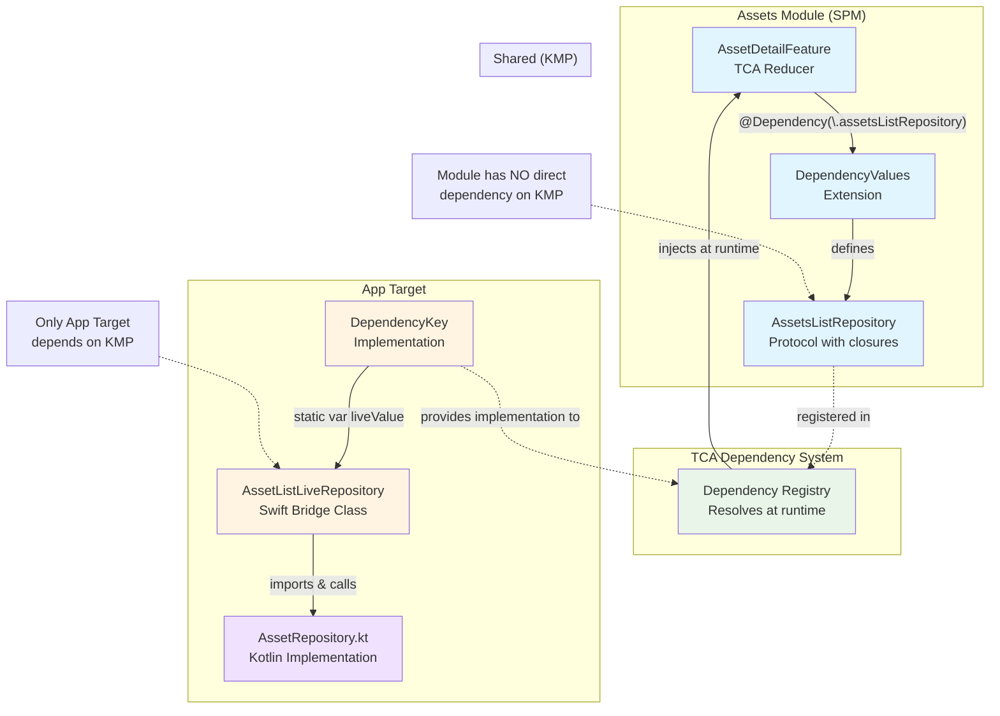
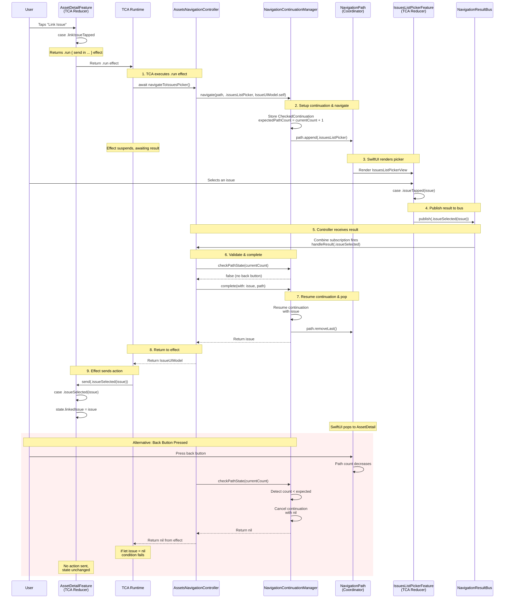

# iOS Modularization POC with Kotlin Multiplatform

A proof-of-concept demonstrating modular iOS architecture with Kotlin Multiplatform (KMP), featuring async navigation with lifecycle-aware continuations.

## Table of Contents

- [Overview](#overview)
- [Architecture](#architecture)
  - [KMP Repository Injection Flow Diagram](#diagram-kmp-repository-injection-flow)
- [Navigation Pattern](#navigation-pattern)
  - [Async Navigation with Result Flow Diagram](#diagram-async-navigation-with-result-flow)
- [Key Patterns](#key-patterns)
- [Pros and Cons](#pros-and-cons)

## Overview

Demonstrates modular iOS architecture with Kotlin Multiplatform for shared business logic, featuring:
- Swift Package Manager modules with protocol abstractions (no direct KMP dependency)
- Path-based navigation with async/await for result-returning screens
- Lifecycle-aware continuation management to prevent memory leaks
- TCA for state management with Combine bridge for navigation

## Architecture

### Critical Constraint

**Only the App target should depend on KMP.** SPM modules use protocol abstractions; the App target provides KMP implementations.

### Module Structure

```
CoreInterfaces (SPM)  → Protocols & Models
Assets Module (SPM)   → Asset Features
Issues Module (SPM)   → Issue Features
App Target            → Coordinator, Navigation, KMP Bridge
Shared (KMP)          → Business Logic
```

### Dependency Injection

1. Modules define repository protocols
2. App target implements using KMP
3. TCA's `@Dependency` system injects implementations

#### Diagram: KMP Repository Injection Architecture



## Navigation Pattern

### Path-Based Navigation

Cross-module navigation uses a **single NavigationPath** managed by the App Coordinator:

```swift
NavigationStack(path: $coordinator.path) {
    RootView()
        .navigationDestination(for: Destination.self) { destination in
            destinationView(for: destination)
        }
}
```

**Rule:** Screens that navigate cross-module must be in the path. Use TCA's `@Presents` only for modals or module-internal navigation.

### Async Navigation with Result Handling

Result-returning screens (pickers, scanners) use async/await:

```swift
// In feature
@Dependency(\.assetsNavigationController) var navigationController

case .linkIssueTapped:
    return .run { send in
        if let issue = await navigationController.navigateToIssuesPicker() {
            await send(.issueSelected(issue))
        }
    }
```

The controller handles the navigation and waits for the result via the result bus.

#### Diagram: Async Navigation with Result Flow



## Key Patterns

### 1. Lifecycle-Aware Continuation Manager

A type-erased manager prevents memory leaks when users press Back during async navigation:

```swift
final class NavigationContinuationManager: @unchecked Sendable {
    private var activeContinuation: AnyContinuation?
    private var expectedPathCount: Int?
    
    var hasActiveNavigation: Bool {
        activeContinuation != nil
    }
    
    func navigate<Result: Sendable>(
        path: Binding<NavigationPath>,
        append destination: any Hashable,
        resultType: Result.Type
    ) async -> Result? {
        // Single manager handles all navigation types
        // Defensively cleans up existing continuations
        // Tracks path depth to detect Back button
    }
    
    func complete<Result: Sendable>(
        with result: Result,
        path: Binding<NavigationPath>
    ) {
        // Type-safe completion
        // Only processes matching result types
    }
    
    func checkPathState(currentCount: Int) -> Bool {
        // Detects Back button navigation
        // Returns true if cleanup occurred
    }
}
```

**Key Features:**
- Single manager for all navigation types (scalable)
- Detects Back button by tracking path count
- Type-safe result matching
- O(1) performance regardless of navigation types

### 2. Navigation Result Bus

Centralized bus eliminates circular dependencies between navigation controllers:

```swift
final class NavigationResultBus {
    enum Result {
        case issueSelected(IssueUIModel?)
        case barcodeScanned(String?)
        // Add more as needed
    }
    
    func publish(_ result: Result)
    var results: AnyPublisher<Result, Never>
}
```

Controllers publish results to the bus; other controllers subscribe to receive them.

### 3. Module Navigation Publishers

Each module has a publisher for navigation actions:

```swift
final class AssetsNavigation {
    enum Action {
        case assetTapped(id: String)
        case linkIssueTapped
    }
    let publisher = PassthroughSubject<Action, Never>()
}
```

TCA actions are bridged to Combine via ActionObserver in the App target.

## Pros and Cons

### Pros
- Faster builds (incremental, parallel compilation)
- Clear module boundaries and ownership
- SwiftUI Previews without KMP
- Testable in isolation
- CI/CD benefits (cached builds)
- No strict dependency on TCA at the Coordinator level

### Cons
- Back button without result logic is a bit hacky.
- Navigation complexity (coordinator pattern, continuation management)
- KMP abstraction layer boilerplate
- Learning curve (TCA + Combine + Async/Await + Coordinator)

## Code Examples

### Repository Protocol in Module

```swift
public struct AssetsListRepository {
    public var getAllAssets: @Sendable () async -> [AssetUIModel]
}

extension DependencyValues {
    public var assetsListRepository: AssetsListRepository {
        get { self[AssetsListRepository.self] }
        set { self[AssetsListRepository.self] = newValue }
    }
}
```

### Injection provided in App Target

```swift
extension Assets.AssetsListRepository: @retroactive DependencyKey {
    public static var liveValue: Assets.AssetsListRepository {
        // Swift live repository that bridges Swift code to/from Kotlin
        let liveRepo = AssetListLiveRepository()
        return Self(
            getAllAssets: {
                return kmpRepo.getAllAssets()
            }
        )
    }
}
```

### Navigation Controller with Continuation Manager

```swift
final class AssetsNavigationController: AssetsNavigationControllerProtocol {
    private let navigationManager = NavigationContinuationManager()
    
    private func handleResult(_ result: NavigationResultBus.Result) {
        guard navigationManager.hasActiveNavigation else { return }
        
        if navigationManager.checkPathState(currentCount: path.wrappedValue.count) {
            return  // Back button pressed
        }
        
        switch result {
        case .issueSelected(let issue):
            if let issue = issue {
                navigationManager.complete(with: issue, path: path)
            } else {
                navigationManager.cancel(path: path)
            }
        default:
            break
        }
    }
    
    func navigateToIssuesPicker() async -> IssueUIModel? {
        return await navigationManager.navigate(
            path: path,
            append: Destination.issuesListPicker,
            resultType: IssueUIModel.self
        )
    }
}
```

### TCA Feature with Async Navigation

```swift
@Reducer
public struct AssetDetailFeature {
    @Dependency(\.assetsNavigationController) var navigationController
    
    public var body: some ReducerOf<Self> {
        Reduce { state, action in
            switch action {
            case .linkIssueTapped:
                return .run { send in
                    if let issue = await navigationController.navigateToIssuesPicker() {
                        await send(.issueSelected(issue))
                    }
                }
            case .issueSelected(let issue):
                state.linkedIssue = issue
                return .none
            }
        }
    }
}
```
