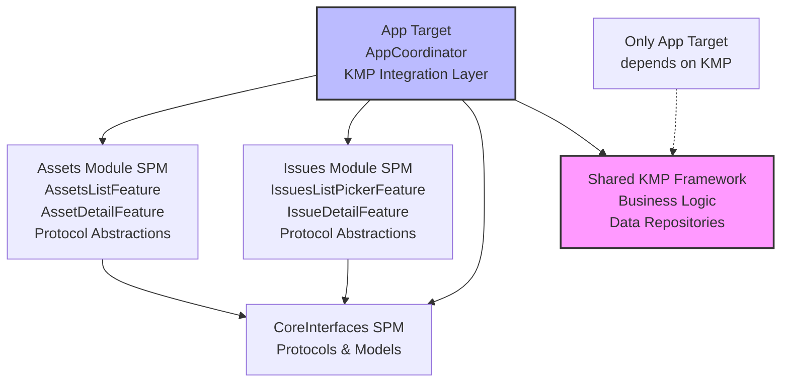
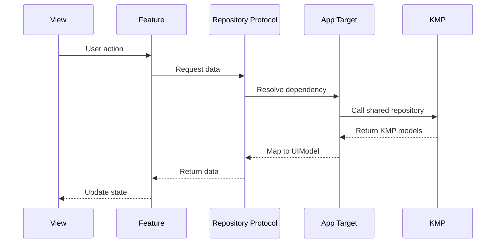
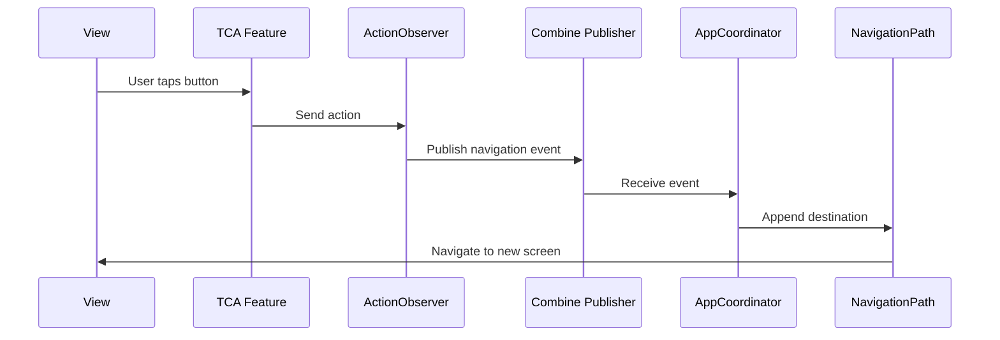
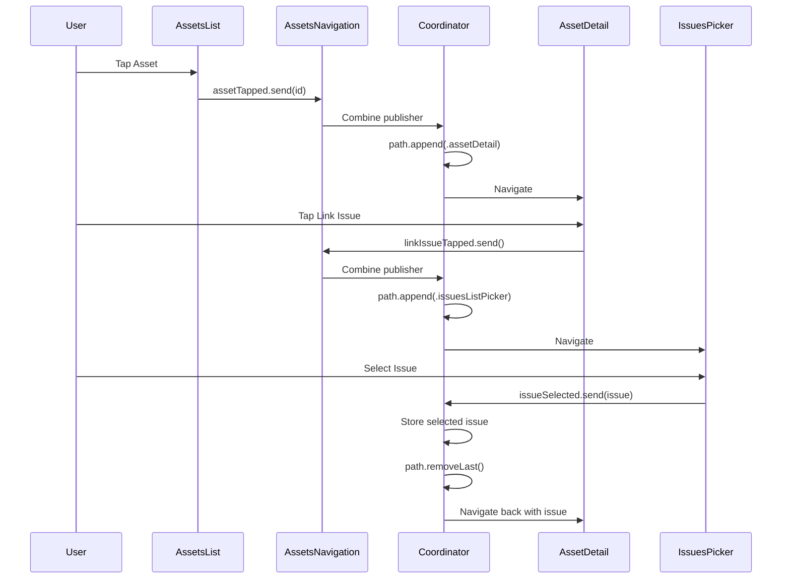
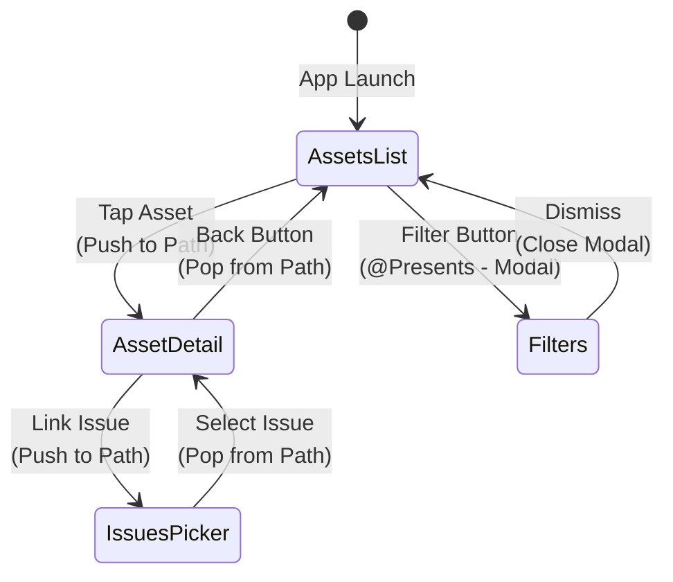

# iOS Modularization POC with Kotlin Multiplatform

A proof-of-concept demonstrating how to modularize an iOS application that uses Kotlin Multiplatform (KMP) for shared business logic, while maintaining proper navigation, testability, and preview support.

## Table of Contents

- [Overview](#overview)
- [Problems Solved](#problems-solved)
- [Architecture](#architecture)
- [The Navigation Pattern Problem](#the-navigation-pattern-problem)
- [Pros and Cons](#pros-and-cons)
- [Code Examples](#code-examples)

## Overview

This project demonstrates a scalable architecture for building modular iOS applications that integrate with Kotlin Multiplatform. It showcases how to structure Swift Package Manager (SPM) modules that cannot directly depend on KMP frameworks, while maintaining proper cross-module navigation using The Composable Architecture (TCA) and the Coordinator pattern.

## Problems Solved

### 1. Modularization with KMP
Structuring an iOS app into independent Swift Package modules while integrating Kotlin Multiplatform for shared business logic.

### 2. SPM + KMP Limitation
Swift Package Manager modules cannot directly depend on KMP frameworks. Only the App target can link the KMP framework, requiring a protocol abstraction layer.

### 3. Cross-Module Navigation
Ensuring proper back button behavior when navigating between screens from different modules. The challenge was maintaining a single navigation stack across module boundaries.

### 4. SwiftUI Previews
Enabling SwiftUI Previews in modular architecture without requiring KMP dependencies, allowing developers to preview UI components in isolation.

### 5. Testability
Module isolation allows testing features without KMP dependencies by providing mock implementations through TCA's dependency injection system.

## Architecture

### Critical Constraint

**Only the App target can depend on the KMP framework.** Swift Package modules use protocol abstractions, and the App target provides live implementations using KMP.

### Module Structure

```
- CoreInterfaces (SPM): Shared protocols and models (NO KMP dependency)
- Assets Module (SPM): Asset management features (NO KMP dependency)
- Issues Module (SPM): Issue tracking features (NO KMP dependency)
- App Target: Coordinator, composition layer, and KMP integration (ONLY target with KMP)
- Shared (KMP): Kotlin Multiplatform business logic and repositories
```

### Module Dependency Graph



### Dependency Injection Pattern

1. **Modules define repository protocols** in their own package
2. **App target implements live repositories** that communicates with KMP
3. **App target overrides `DependencyKey.liveValue`** with live implementations

### Coordinator Architecture

The AppCoordinator uses **vanilla SwiftUI with the Observation framework**, removing dependency on third-party navigation libraries:

1. **@Observable coordinator** - Uses Apple's Observation framework (iOS 17+)
2. **NavigationPath** - Apple's type-erased navigation stack
3. **Per-module navigation controllers** - Each module has its own controller that handles navigation logic
4. **Combine publishers** - Module-specific navigation publishers bridge TCA features to controllers
5. **Async/await navigation** - Result-returning navigation (pickers, scanners) uses async methods
6. **Action observers** - Intercept TCA actions and publish to Combine without modifying feature modules

### Data Flow with KMP



### Navigation Flow with Combine



### Navigation Flow



### Navigation Stack States



## The Navigation Pattern Problem

### Understanding Two Navigation Methods

SwiftUI and TCA provide two fundamentally different approaches to navigation, and **mixing them incorrectly causes disconnected navigation stacks**:

#### 1. Path-Based Navigation (NavigationStack)

```swift
NavigationStack(path: $path) {
    RootView()
        .navigationDestination(for: Destination.self) { destination in
            // Views pushed here are part of the path
        }
}
```

**Characteristics:**
- Uses a type-erased array/stack (`NavigationPath`)
- Each navigation appends to the path
- Back button pops from the path
- All screens in the path share the same navigation context

#### 2. Tree-Based Navigation (TCA @Presents)

```swift
@ObservableState
struct State {
    @Presents var destination: Destination.State?
}

// In view
.navigationDestination(item: $store.scope(state: \.destination)) { store in
    // View shown when destination is non-nil
}
```

**Characteristics:**
- Uses optional state (`Destination?`)
- Setting state to non-nil shows the screen
- Setting state to nil dismisses the screen
- Creates a separate navigation context

### The Critical Problem: Disconnected Stacks

**What happens when you mix them incorrectly:**

```
Assets List (in path)
  ├─> Asset Detail (@Presents - NOT in path) ⚠️
        └─> Issues Picker (in separate path) ⚠️
```

**Result:**
1. Assets List is in the main `NavigationStack` path
2. Asset Detail uses `@Presents` - iOS treats this as a separate navigation context
3. When Asset Detail navigates to Issues Picker, iOS sees this as starting a **new** navigation stack
4. The back button from Issues Picker thinks the previous screen was Assets List (the last screen in the path)
5. Asset Detail is **skipped** when going back!

### Why This Happens

SwiftUI's `NavigationStack` manages navigation history through the `path`. When you use `@Presents` with `.navigationDestination(item:)`, you're creating a navigation destination that's **outside the path**. From iOS's perspective:

- **Path contains:** `[AssetsList]`
- **@Presents shows:** `AssetDetail` (not tracked in path)
- **New path started from AssetDetail:** `[IssuesPicker]`

When you tap back from IssuesPicker, iOS looks at the path and sees only `AssetsList`, so it navigates there, skipping the `@Presents` destination.

### The Solution: Consistent Path-Based Navigation

For cross-module navigation chains, **all screens must be in the same path**:

```swift
// ✅ Correct: All screens in coordinator's path
@Reducer
struct AppCoordinator {
    @ObservableState
    struct State {
        var path = StackState<Path.State>()  // Single source of truth
        var assetsList = AssetsListFeature.State()
    }
    
    @Reducer
    enum Path {
        case assetDetail(AssetDetailFeature)      // In path ✓
        case issuesListPicker(IssuesListPickerFeature)  // In path ✓
    }
}
```

**Result:**
- Path contains: `[AssetsList] → [AssetDetail] → [IssuesPicker]`
- Back button correctly navigates: IssuesPicker → AssetDetail → AssetsList

### When Each Method Should Be Used

| Method | Use Case | Example |
|--------|----------|---------|
| **Path-Based (StackState)** | Screens that can navigate to other modules | AssetDetail, IssuesPicker |
| **Optional-Based (@Presents)** | Internal-only screens, modals, sheets | AssetFilters |

**Rule of Thumb:**
- If a screen might navigate to another module → **Path-based**
- If a screen only navigates within its own module → **@Presents** is fine
- Modal presentations (sheets, popovers) → **@Presents** is fine

### Visual Comparison

**❌ Incorrect: Mixed Navigation**
```
NavigationStack(path: assetsPath)
  └─ Assets List
       └─ Asset Detail (@Presents) ⚠️
            └─ NavigationStack(path: issuesPath) ⚠️
                 └─ Issues Picker

Back button skips Asset Detail!
```

**✅ Correct: Single Path**
```
NavigationStack(path: coordinatorPath)
  ├─ Assets List
  ├─ Asset Detail      ← All in same path
  └─ Issues Picker     ← All in same path

Back button works correctly!
```

## Pros and Cons

### Pros

1. **Development Speed**
   - Faster build times due to incremental builds and parallel compilation
   - Reduced cognitive load: focus on one module at a time
   - Less merge conflicts
   - Easier unit testing
   - Faster test execution: we can test individual modules in isolation
   - SwiftUI Previews
   - Easier to setup demo apps per module

2. **Clear Code Ownership**
   - Teams can own and maintain specific modules
   - Clear boundaries make it easier to assign responsibilities
   - Reduces cross-team dependencies and coordination overhead

3. **Scalability**
   - Architecture grows with the app without becoming unwieldy
   - New features can be added as new modules
   - Coordinator stays lean with hybrid navigation approach
   - Module boundaries enforced by compiler

4. **CI/CD Benefits**
   - Cached module builds: only rebuild changed modules
   - Parallel CI jobs can build and test modules simultaneously
   - Faster feedback loops in CI pipeline
   - Reduced CI costs and build times  

### Cons

1. **Initial Setup Complexity**
   - Setting up modules takes time and requires careful planning
   - More upfront architecture decisions needed
   - Initial setup overhead for each new module
   - Team needs to agree on module boundaries and responsibilities

2. **Navigation Complexity**
   - Navigation becomes more complex with coordinator pattern
   - Must decide which screens go in path vs @Presents
   - Coordinator coupling: knows about screens from multiple modules
   - Deep `@Presents` nesting cannot navigate cross-module in push / drilldown way
   - Requires understanding of Combine publishers and action observation
   - SwiftUI Previews work for individual screens but cannot test path-based navigation flows (handled by AppCoordinator)
   - Bridge layer needed between TCA actions and Combine publishers

3. **KMP Abstraction Layer**
   - Need to write code that abstracts the Kotlin layer
   - App target must implement all repository bridges to KMP
   - Manual mapping between KMP models and Swift UIModels
   - Additional boilerplate for dependency injection

4. **Learning Curve**
   - Team must learn multiple patterns: TCA + Combine + Coordinator + Dependency Injection
   - Understanding when to use path-based vs optional-based navigation
   - Requires knowledge of both Swift and Kotlin ecosystems
   - Understanding Combine publishers and action observation patterns

## Code Examples

### Module Defines Protocol

Modules define what they need without knowing how it's implemented:

```swift
// Modules/Assets/Sources/Assets/Dependencies/AssetsListRepository.swift
import ComposableArchitecture
import CoreInterfaces

public struct AssetsListRepository {
    public var getAllAssets: @Sendable () async -> [AssetUIModel]
    
    public init(getAllAssets: @escaping @Sendable () async -> [AssetUIModel]) {
        self.getAllAssets = getAllAssets
    }
}

extension DependencyValues {
    public var assetsListRepository: AssetsListRepository {
        get { self[AssetsListRepository.self] }
        set { self[AssetsListRepository.self] = newValue }
    }
}
```

### App Target Provides KMP Implementation

The App target bridges Swift modules and KMP:

```swift
// modularizediOSApp/Assets/Dependencies/AssetsListLiveRepository.swift
import Assets
import CoreInterfaces
import ComposableArchitecture
import shared // KMP framework

public struct AssetsListLiveRepository: @unchecked Sendable {
    public func getAllAssets() -> [AssetUIModel] {
        let repository = AssetListLiveRepository() // From KMP
        return repository.getAllAssets().map { kmpAsset in
            AssetUIModel(
                id: kmpAsset.id,
                name: kmpAsset.name,
                status: kmpAsset.status
            )
        }
    }
}

extension Assets.AssetsListRepository: @retroactive DependencyKey {
    public static var liveValue: Assets.AssetsListRepository {
        return Self(
            getAllAssets: {
                let repository = AssetsListLiveRepository()
                return repository.getAllAssets()
            }
        )
    }
}
```

### Module-Specific Navigation Publishers

Each module has its own navigation publisher with an Action enum, keeping navigation concerns modular and scalable. **One publisher per module** emits all navigation actions:

```swift
// modularizediOSApp/Assets/AssetsNavigation.swift
import Combine
import CoreInterfaces

final class AssetsNavigation {
    /// All possible navigation actions from the Assets module
    enum Action {
        case assetTapped(id: String)
        case linkIssueTapped
    }
    
    /// Single publisher that emits all navigation actions
    let publisher = PassthroughSubject<Action, Never>()
}
```

```swift
// modularizediOSApp/Issues/IssuesNavigation.swift
import Combine
import CoreInterfaces

final class IssuesNavigation {
    /// All possible navigation actions from the Issues module
    enum Action {
        case issueSelected(IssueUIModel)
        case cancelTapped
    }
    
    /// Single publisher that emits all navigation actions
    let publisher = PassthroughSubject<Action, Never>()
}
```

**Scalability:** Adding 30 new navigation events to a module only requires adding cases to the Action enum - the coordinator still subscribes to just **one publisher per module**.

### Navigation Controllers with Async Results

Each module has its own navigation controller that subscribes to Combine publishers and handles navigation logic. For result-returning navigation (pickers, scanners), controllers expose async methods:

```swift
// modularizediOSApp/Assets/AssetsNavigationController.swift
import Assets
import Combine
import CoreInterfaces
import SwiftUI

final class AssetsNavigationController: AssetsNavigationControllerProtocol {
    private let path: Binding<NavigationPath>
    private var issuePickerContinuation: CheckedContinuation<IssueUIModel?, Never>?
    
    init(path: Binding<NavigationPath>, 
         navigation: AssetsNavigation,
         issuesNavigation: IssuesNavigation) {
        // Subscribe to module's own actions
        navigation.publisher.sink { self?.handle($0) }
        
        // Subscribe to results from other modules (e.g., Issues picker)
        issuesNavigation.publisher.sink { self?.handleIssuesAction($0) }
    }
    
    private func handleIssuesAction(_ action: IssuesNavigation.Action) {
        switch action {
        case .issueSelected(let issue):
            issuePickerContinuation?.resume(returning: issue)
            issuePickerContinuation = nil
            path.wrappedValue.removeLast()
        case .cancelTapped:
            issuePickerContinuation?.resume(returning: nil)
            issuePickerContinuation = nil
            path.wrappedValue.removeLast()
        }
    }
    
    // Async method for result-returning navigation
    func navigateToIssuesPicker() async -> IssueUIModel? {
        return await withCheckedContinuation { continuation in
            issuePickerContinuation = continuation
            path.wrappedValue.append(Destination.issuesListPicker)
        }
    }
}
```

**Benefits of Async Navigation:**
- ✅ Results are tied to the navigation call - no orphaned listeners
- ✅ Type-safe - compiler enforces result handling
- ✅ No race conditions - continuation ensures one-to-one mapping
- ✅ Clean API - feels like a synchronous call but non-blocking

### Feature Uses Async Navigation via TCA Effects

Features call async navigation methods using TCA's `.run` effect. The protocol and dependency key are defined in `CoreInterfaces` so features can access them:

```swift
// Modules/CoreInterfaces/Sources/CoreInterfaces/Navigation/AssetsNavigationControllerDependency.swift
public protocol AssetsNavigationControllerProtocol {
    func navigateToIssuesPicker() async -> IssueUIModel?
}

extension DependencyValues {
    public var assetsNavigationController: AssetsNavigationControllerProtocol {
        get { self[AssetsNavigationControllerKey.self] }
        set { self[AssetsNavigationControllerKey.self] = newValue }
    }
}
```

```swift
// Modules/Assets/Sources/Assets/AssetDetail/AssetDetailFeature.swift
@Reducer
public struct AssetDetailFeature {
    @Dependency(\.assetDetailRepository) var repository
    @Dependency(\.assetsNavigationController) var navigationController
    
    public var body: some ReducerOf<Self> {
        Reduce { state, action in
            switch action {
            case .linkIssueTapped:
                // Return effect that awaits navigation result
                return .run { send in
                    if let issue = await navigationController.navigateToIssuesPicker() {
                        await send(.issueSelected(issue))
                    }
                }
                
            case .issueSelected(let issue):
                state.linkedIssue = issue
                return .none
            }
        }
    }
}
```

**Module Structure:**
- `CoreInterfaces` → Defines protocol & TCA dependency key (shared)
- `Assets` → Uses the dependency (feature module)
- `App Target` → Provides concrete implementation

**Why .run instead of Task:**
- ✅ TCA idiomatic - proper effect testing support
- ✅ Automatic cancellation when feature is torn down
- ✅ Testable - can be mocked in TCA's TestStore
- ✅ Effect lifecycle management

### Coordinator is a Simple Container

The coordinator is now a simple container with **zero navigation logic**. All logic has moved to per-module navigation controllers:

```swift
// modularizediOSApp/AppCoordinator.swift
import Combine
import CoreInterfaces
import Observation
import SwiftUI

enum Destination: Hashable {
    case assetDetail(assetId: String)
    case issuesListPicker
}

@Observable
final class AppCoordinator {
    var path = NavigationPath()
    
    // Module navigation publishers (for features to send actions)
    let assetsNavigation = AssetsNavigation()
    let issuesNavigation = IssuesNavigation()
    
    // Navigation controllers (handle navigation logic)
    private(set) var assetsNavigationController: AssetsNavigationController?
    private(set) var issuesNavigationController: IssuesNavigationController?
    
    init() {}
    
    /// Initialize navigation controllers with path binding
    func setupControllers(pathBinding: Binding<NavigationPath>) {
        issuesNavigationController = IssuesNavigationController(
            path: pathBinding,
            navigation: issuesNavigation
        )
        
        assetsNavigationController = AssetsNavigationController(
            path: pathBinding,
            navigation: assetsNavigation,
            issuesNavigation: issuesNavigation
        )
    }
}
```

**Key Change:** Coordinator has **no** handleAction methods, **no** navigation methods, **no** Combine subscriptions. It's purely a container.

### Bridging TCA to Combine

The app target uses an ActionObserver to intercept TCA actions and publish them to Combine:

```swift
// modularizediOSApp/TCABridge/ActionObserver.swift
import ComposableArchitecture

struct ActionObserver<R: Reducer>: Reducer {
    let base: R
    let observe: (R.Action) -> Void
    
    var body: some ReducerOf<R> {
        Reduce { state, action in
            observe(action)
            return .none
        }
        base
    }
}

extension Reducer {
    func observeActions(_ observe: @escaping (Action) -> Void) -> some Reducer<State, Action> {
        ActionObserver(base: self, observe: observe)
    }
}
```

```swift
// Usage in ContentView - bridges TCA actions to navigation publisher
AssetsListView(
    store: Store(initialState: AssetsListFeature.State()) {
        AssetsListFeature()
            .observeActions { action in
                switch action {
                case .assetTapped(let id):
                    assetsNavigation.publisher.send(.assetTapped(id: id))
                default:
                    break
                }
            }
    }
)
```

**Key Benefit:** The coordinator only needs **2 subscriptions** for this entire app (one per module), regardless of how many navigation actions each module has. In a large app with 10 modules and 30 navigation events per module, you'd still only have **10 subscriptions** total.

### Feature Uses @Presents for Internal Navigation

```swift
// Modules/Assets/Sources/Assets/AssetsList/AssetsListFeature.swift
@Reducer
public struct AssetsListFeature: Sendable {
    @ObservableState
    public struct State: Equatable {
        var assets: [AssetUIModel] = []
        @Presents var destination: Destination.State? // Internal navigation
        // ...
    }
    
    public enum Action {
        case assetTapped(id: String) // Coordinator intercepts this
        case filtersTapped // Internal navigation
        case destination(PresentationAction<Destination.Action>)
        // ...
    }
    
    @Reducer(state: .equatable)
    public enum Destination {
        case filters(AssetFiltersFeature) // Purely internal to Assets module
    }
    
    public var body: some ReducerOf<Self> {
        Reduce { state, action in
            switch action {
            case .filtersTapped:
                // Show filters sheet - pure internal navigation!
                state.destination = .filters(AssetFiltersFeature.State(
                    selectedStatuses: state.selectedStatuses,
                    selectedCategories: state.selectedCategories
                ))
                return .none
            // ...
            }
        }
        .ifLet(\.$destination, action: \.destination)
    }
}
```
