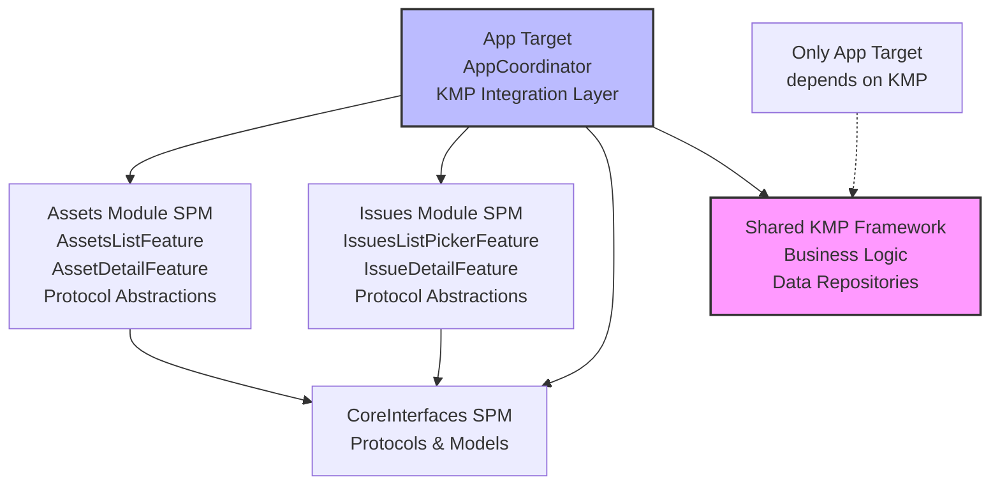
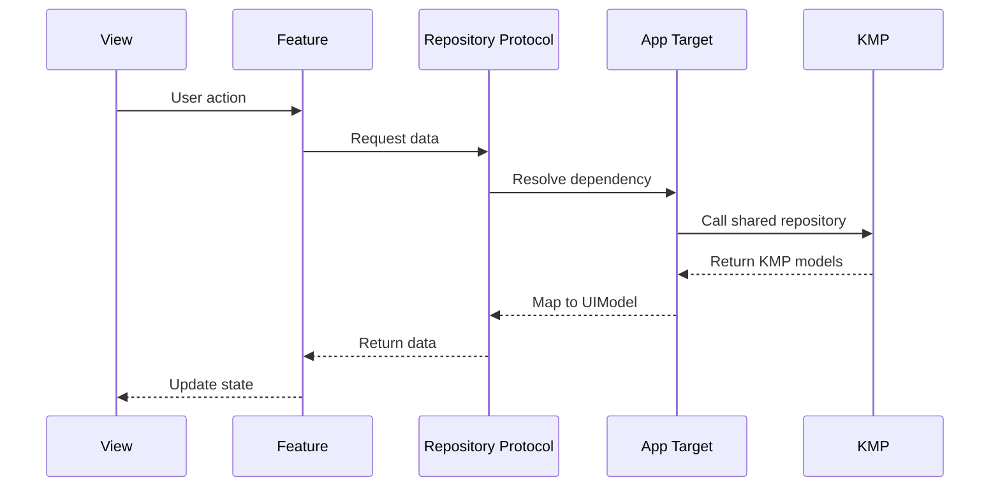
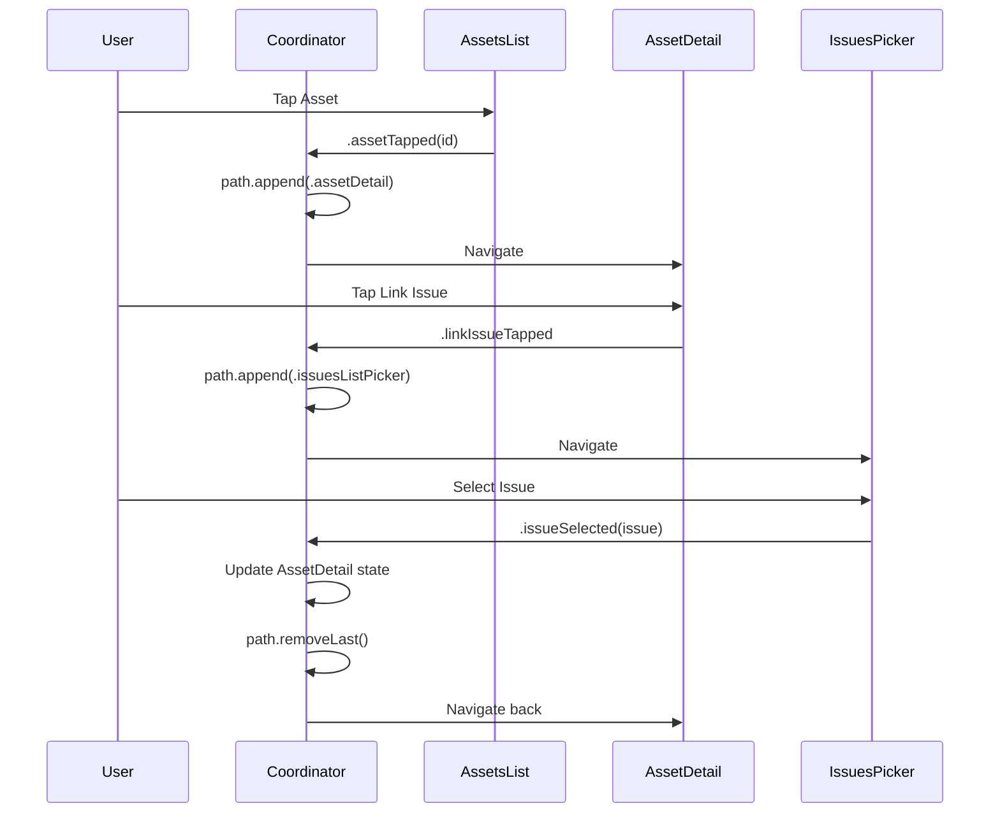
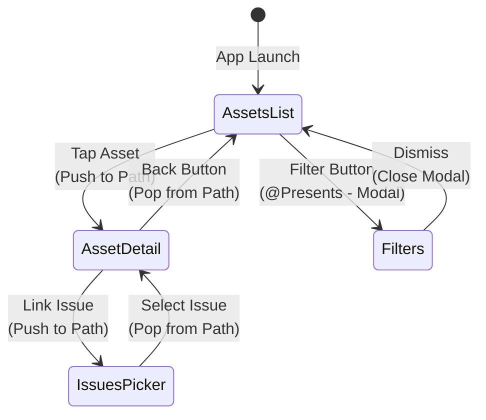

# iOS Modularization POC with Kotlin Multiplatform

A proof-of-concept demonstrating how to modularize an iOS application that uses Kotlin Multiplatform (KMP) for shared business logic, while maintaining proper navigation, testability, and preview support.

## Table of Contents

- [Overview](#overview)
- [Problems Solved](#problems-solved)
- [Architecture](#architecture)
- [Key Concepts](#key-concepts)
- [The Navigation Pattern Problem](#the-navigation-pattern-problem)
- [Problems & Solutions](#problems--solutions)
- [Pros and Cons](#pros-and-cons)
- [Key Learnings](#key-learnings)
- [Project Structure](#project-structure)
- [Code Examples](#code-examples)
- [Getting Started](#getting-started)
- [Technologies Used](#technologies-used)
- [Future Improvements](#future-improvements)

## Overview

This project demonstrates a scalable architecture for building modular iOS applications that integrate with Kotlin Multiplatform. It showcases how to structure Swift Package Manager (SPM) modules that cannot directly depend on KMP frameworks, while maintaining proper cross-module navigation using The Composable Architecture (TCA) and the Coordinator pattern.

## Problems Solved

### 1. Modularization with KMP
Structuring an iOS app into independent Swift Package modules while integrating Kotlin Multiplatform for shared business logic.

### 2. SPM + KMP Limitation
Swift Package Manager modules cannot directly depend on KMP frameworks. Only the App target can link the KMP framework, requiring a protocol abstraction layer.

### 3. Cross-Module Navigation
Ensuring proper back button behavior when navigating between screens from different modules. The challenge was maintaining a single navigation stack across module boundaries.

### 4. SwiftUI Previews
Enabling SwiftUI Previews in modular architecture without requiring KMP dependencies, allowing developers to preview UI components in isolation.

### 5. Testability
Module isolation allows testing features without KMP dependencies by providing mock implementations through TCA's dependency injection system.

## Architecture

### Critical Constraint

**Only the App target can depend on the KMP framework.** Swift Package modules use protocol abstractions, and the App target provides live implementations using KMP.

### Module Structure

```
- CoreInterfaces (SPM): Shared protocols and models (NO KMP dependency)
- Assets Module (SPM): Asset management features (NO KMP dependency)
- Issues Module (SPM): Issue tracking features (NO KMP dependency)
- App Target: Coordinator, composition layer, and KMP integration (ONLY target with KMP)
- Shared (KMP): Kotlin Multiplatform business logic and repositories
```

### Module Dependency Graph



### Dependency Injection Pattern

1. **Modules define repository protocols** in their own package
2. **App target implements live repositories** that communicates with KMP
3. **App target overrides `DependencyKey.liveValue`** with live implementations

### Data Flow with KMP



### Navigation Flow



### Navigation Stack States



## Key Concepts

### KMP Integration Pattern

- **Modules define what they need** (protocols) but not how (implementations)
- **App target bridges** Swift modules and KMP framework
- **Live repositories** in App target (e.g., `AssetsListLiveRepository.swift`) map KMP models to UIModels
- **Enables SwiftUI Previews** in modules without KMP framework
- **Test targets provide mock data** without KMP

### Coordinator Pattern

- **Centralized navigation management** in `AppCoordinator.swift`
- **Observes only cross-module navigation actions** via TCA composition
- **Manages single `NavigationStack` path** for cross-module navigation
- **Handles cross-module data flow** (e.g., passing selected issue to asset detail)

### Navigation Strategy (Hybrid Approach)

- **Coordinator Path**: Cross-module capable screens (AssetDetail, IssuesPicker)
  - These screens are added to the coordinator's `StackState`
  - Ensures proper back button behavior across module boundaries
  
- **@Presents**: Internal-only screens (Filters, Settings)
  - These screens stay within their module
  - Don't navigate to other modules
  - Keeps the coordinator lean and focused

### TCA Composition

- **Parent features observe child actions** through reducer composition
- **Action bubbling** enables coordinator to intercept navigation actions
- **State updates** managed through reducers
- **Dependencies injected** via TCA's dependency system

## The Navigation Pattern Problem

### Understanding Two Navigation Methods

SwiftUI and TCA provide two fundamentally different approaches to navigation, and **mixing them incorrectly causes disconnected navigation stacks**:

#### 1. Path-Based Navigation (NavigationStack)

```swift
NavigationStack(path: $path) {
    RootView()
        .navigationDestination(for: Destination.self) { destination in
            // Views pushed here are part of the path
        }
}
```

**Characteristics:**
- Uses a type-erased array/stack (`NavigationPath`)
- Each navigation appends to the path
- Back button pops from the path
- All screens in the path share the same navigation context

#### 2. Tree-Based Navigation (TCA @Presents)

```swift
@ObservableState
struct State {
    @Presents var destination: Destination.State?
}

// In view
.navigationDestination(item: $store.scope(state: \.destination)) { store in
    // View shown when destination is non-nil
}
```

**Characteristics:**
- Uses optional state (`Destination?`)
- Setting state to non-nil shows the screen
- Setting state to nil dismisses the screen
- Creates a separate navigation context

### The Critical Problem: Disconnected Stacks

**What happens when you mix them incorrectly:**

```
Assets List (in path)
  ├─> Asset Detail (@Presents - NOT in path) ⚠️
        └─> Issues Picker (in separate path) ⚠️
```

**Result:**
1. Assets List is in the main `NavigationStack` path
2. Asset Detail uses `@Presents` - iOS treats this as a separate navigation context
3. When Asset Detail navigates to Issues Picker, iOS sees this as starting a **new** navigation stack
4. The back button from Issues Picker thinks the previous screen was Assets List (the last screen in the path)
5. Asset Detail is **skipped** when going back!

### Why This Happens

SwiftUI's `NavigationStack` manages navigation history through the `path`. When you use `@Presents` with `.navigationDestination(item:)`, you're creating a navigation destination that's **outside the path**. From iOS's perspective:

- **Path contains:** `[AssetsList]`
- **@Presents shows:** `AssetDetail` (not tracked in path)
- **New path started from AssetDetail:** `[IssuesPicker]`

When you tap back from IssuesPicker, iOS looks at the path and sees only `AssetsList`, so it navigates there, skipping the `@Presents` destination.

### The Solution: Consistent Path-Based Navigation

For cross-module navigation chains, **all screens must be in the same path**:

```swift
// ✅ Correct: All screens in coordinator's path
@Reducer
struct AppCoordinator {
    @ObservableState
    struct State {
        var path = StackState<Path.State>()  // Single source of truth
        var assetsList = AssetsListFeature.State()
    }
    
    @Reducer
    enum Path {
        case assetDetail(AssetDetailFeature)      // In path ✓
        case issuesListPicker(IssuesListPickerFeature)  // In path ✓
    }
}
```

**Result:**
- Path contains: `[AssetsList] → [AssetDetail] → [IssuesPicker]`
- Back button correctly navigates: IssuesPicker → AssetDetail → AssetsList

### When Each Method Should Be Used

| Method | Use Case | Example |
|--------|----------|---------|
| **Path-Based (StackState)** | Screens that can navigate to other modules | AssetDetail, IssuesPicker |
| **Optional-Based (@Presents)** | Internal-only screens, modals, sheets | AssetFilters |

**Rule of Thumb:**
- If a screen might navigate to another module → **Path-based**
- If a screen only navigates within its own module → **@Presents** is fine
- Modal presentations (sheets, popovers) → **@Presents** is fine

### Visual Comparison

**❌ Incorrect: Mixed Navigation**
```
NavigationStack(path: assetsPath)
  └─ Assets List
       └─ Asset Detail (@Presents) ⚠️
            └─ NavigationStack(path: issuesPath) ⚠️
                 └─ Issues Picker

Back button skips Asset Detail!
```

**✅ Correct: Single Path**
```
NavigationStack(path: coordinatorPath)
  ├─ Assets List
  ├─ Asset Detail      ← All in same path
  └─ Issues Picker     ← All in same path

Back button works correctly!
```

### Problem 1: SPM Cannot Depend on KMP Framework

**Problem:** Swift Package Manager modules cannot link KMP .framework files directly.

**Solution:** 
- Protocol abstraction layer in modules
- App target provides concrete implementations using KMP
- Dependency injection via TCA's `@Dependency` system

**Benefits:**
- Modules work in isolation
- SwiftUI Previews don't need KMP
- Tests use mocks instead of real KMP implementations

### Problem 2: Cross-Module Navigation Back Button

**Problem:** Back button showed "Assets" from Issues screen, skipping Asset Detail because:
- Asset Detail used TCA `@Presents` (not in NavigationStack path)
- Issues used separate `NavigationPath`
- iOS saw disconnected navigation stacks

**Solution:** 
- Coordinator with single `NavigationStack.StackState` for all cross-module screens
- All screens that participate in cross-module navigation are added to the coordinator's path
- Proper back button hierarchy: Issues → Asset Detail → Assets List

### Problem 3: Module Communication Without Direct Dependencies

**Problem:** Assets module cannot depend on Issues module (and vice versa), but they need to communicate.

**Solution:**
- App target coordinator observes actions from both modules
- Coordinator orchestrates navigation and data flow
- Updates state across features via `StackState` manipulation

### Problem 4: SwiftUI Previews in Modules

**Problem:** Previews need data but modules cannot depend on KMP.

**Solution:** Test dependencies with mock data.

**Example:**
```swift
#Preview {
    AssetsListView(store: Store(initialState: AssetsListFeature.State()) {
        AssetsListFeature()
    } withDependencies: {
        $0.assetsListRepository.getAllAssets = { 
            [
                AssetUIModel(id: "1", name: "Asset 1", status: "Active"),
                AssetUIModel(id: "2", name: "Asset 2", status: "Inactive")
            ]
        }
    })
}
```

## Pros and Cons

### Pros

1. **Development Speed**
   - Faster build times due to incremental builds and parallel compilation
   - Reduced cognitive load: focus on one module at a time
   - Less merge conflicts
   - Easier unit testing
   - Faster test execution: we can test individual modules in isolation
   - SwiftUI Previews
   - Easier to setup demo apps per module

2. **Clear Code Ownership**
   - Teams can own and maintain specific modules
   - Clear boundaries make it easier to assign responsibilities
   - Reduces cross-team dependencies and coordination overhead

3. **Scalability**
   - Architecture grows with the app without becoming unwieldy
   - New features can be added as new modules
   - Coordinator stays lean with hybrid navigation approach
   - Module boundaries enforced by compiler

4. **CI/CD Benefits**
   - Cached module builds: only rebuild changed modules
   - Parallel CI jobs can build and test modules simultaneously
   - Faster feedback loops in CI pipeline
   - Reduced CI costs and build times  

### Cons

1. **Initial Setup Complexity**
   - Setting up modules takes time and requires careful planning
   - More upfront architecture decisions needed
   - Initial setup overhead for each new module
   - Team needs to agree on module boundaries and responsibilities

2. **Navigation Complexity**
   - Navigation becomes more complex with coordinator pattern
   - Must decide which screens go in path vs @Presents
   - Coordinator coupling: knows about screens from multiple modules
   - Deep `@Presents` nesting cannot navigate cross-module in push / drilldown way
   - Requires understanding of TCA navigation patterns

3. **KMP Abstraction Layer**
   - Need to write code that abstracts the Kotlin layer
   - App target must implement all repository bridges to KMP
   - Manual mapping between KMP models and Swift UIModels
   - Additional boilerplate for dependency injection

4. **Learning Curve**
   - Team must learn multiple patterns: TCA + Coordinator + Dependency Injection
   - Understanding when to use path-based vs optional-based navigation
   - Requires knowledge of both Swift and Kotlin ecosystems  

## Key Learnings

### KMP Integration Rules

1. **Only App target links KMP framework**
2. **Modules define repository protocols**, App target provides KMP implementations
3. **Use TCA's dependency system** for injection
4. **Map KMP models to UIModels** in App target's live repositories

### Navigation Rules

1. **Cross-module capable screens** must be in coordinator path
2. **Internal-only screens** can use `@Presents`
3. **Cannot mix `@Presents` with cross-module navigation** (creates disconnected stacks) - see [The Navigation Pattern Problem](#the-navigation-pattern-problem) for detailed explanation
4. **Coordinator intercepts actions** to manage navigation
5. **Single NavigationStack path** ensures proper back button behavior across all modules

### Architecture Decisions

- **Removed Navigator protocol** (callbacks) in favor of TCA action observation
- **Protocol-based repository abstractions** in modules
- **Direct state mutation** in coordinator for cross-feature updates
- **`@retroactive` conformance** for `DependencyKey` in App target

## Code Examples

### Module Defines Protocol

Modules define what they need without knowing how it's implemented:

```swift
// Modules/Assets/Sources/Assets/Dependencies/AssetsListRepository.swift
import ComposableArchitecture
import CoreInterfaces

public struct AssetsListRepository {
    public var getAllAssets: @Sendable () async -> [AssetUIModel]
    
    public init(getAllAssets: @escaping @Sendable () async -> [AssetUIModel]) {
        self.getAllAssets = getAllAssets
    }
}

extension DependencyValues {
    public var assetsListRepository: AssetsListRepository {
        get { self[AssetsListRepository.self] }
        set { self[AssetsListRepository.self] = newValue }
    }
}
```

### App Target Provides KMP Implementation

The App target bridges Swift modules and KMP:

```swift
// modularizediOSApp/Assets/Dependencies/AssetsListLiveRepository.swift
import Assets
import CoreInterfaces
import ComposableArchitecture
import shared // KMP framework

public struct AssetsListLiveRepository: @unchecked Sendable {
    public func getAllAssets() -> [AssetUIModel] {
        let repository = AssetListLiveRepository() // From KMP
        return repository.getAllAssets().map { kmpAsset in
            AssetUIModel(
                id: kmpAsset.id,
                name: kmpAsset.name,
                status: kmpAsset.status
            )
        }
    }
}

extension Assets.AssetsListRepository: @retroactive DependencyKey {
    public static var liveValue: Assets.AssetsListRepository {
        return Self(
            getAllAssets: {
                let repository = AssetsListLiveRepository()
                return repository.getAllAssets()
            }
        )
    }
}
```

### Coordinator Manages Cross-Module Navigation

```swift
// modularizediOSApp/AppCoordinator.swift
import ComposableArchitecture
import Assets
import Issues

@Reducer
struct AppCoordinator {
    @ObservableState
    struct State: Equatable {
        var path = StackState<Path.State>()
        var assetsList = AssetsListFeature.State()
    }
    
    enum Action {
        case path(StackActionOf<Path>)
        case assetsList(AssetsListFeature.Action)
    }
    
    @Reducer(state: .equatable)
    enum Path {
        case assetDetail(AssetDetailFeature)
        case issuesListPicker(IssuesListPickerFeature)
    }
    
    var body: some ReducerOf<Self> {
        Scope(state: \.assetsList, action: \.assetsList) {
            AssetsListFeature()
        }
        
        Reduce { state, action in
            switch action {
            // Navigate from Assets List to Asset Detail
            case let .assetsList(.assetTapped(id)):
                state.path.append(.assetDetail(AssetDetailFeature.State(assetId: id)))
                return .none
                
            // Navigate from Asset Detail to Issues Picker
            case .path(.element(id: _, action: .assetDetail(.linkIssueTapped))):
                state.path.append(.issuesListPicker(IssuesListPickerFeature.State()))
                return .none
                
            // Return from Issues Picker with selected issue
            case let .path(.element(id: _, action: .issuesListPicker(.issueSelected(issue)))):
                // Update the AssetDetail state with selected issue
                for id in state.path.ids {
                    if case .assetDetail(var assetDetailState) = state.path[id: id] {
                        assetDetailState.linkedIssue = issue
                        state.path[id: id] = .assetDetail(assetDetailState)
                        break
                    }
                }
                // Pop back to Asset Detail
                state.path.removeLast()
                return .none
                
            // Cancel Issues Picker
            case .path(.element(id: _, action: .issuesListPicker(.cancelTapped))):
                state.path.removeLast()
                return .none
                
            default:
                return .none
            }
        }
        .forEach(\.path, action: \.path)
    }
}
```

### Feature Uses @Presents for Internal Navigation

```swift
// Modules/Assets/Sources/Assets/AssetsList/AssetsListFeature.swift
@Reducer
public struct AssetsListFeature: Sendable {
    @ObservableState
    public struct State: Equatable {
        var assets: [AssetUIModel] = []
        @Presents var destination: Destination.State? // Internal navigation
        // ...
    }
    
    public enum Action {
        case assetTapped(id: String) // Coordinator intercepts this
        case filtersTapped // Internal navigation
        case destination(PresentationAction<Destination.Action>)
        // ...
    }
    
    @Reducer(state: .equatable)
    public enum Destination {
        case filters(AssetFiltersFeature) // Purely internal to Assets module
    }
    
    public var body: some ReducerOf<Self> {
        Reduce { state, action in
            switch action {
            case .filtersTapped:
                // Show filters sheet - pure internal navigation!
                state.destination = .filters(AssetFiltersFeature.State(
                    selectedStatuses: state.selectedStatuses,
                    selectedCategories: state.selectedCategories
                ))
                return .none
            // ...
            }
        }
        .ifLet(\.$destination, action: \.destination)
    }
}
```
